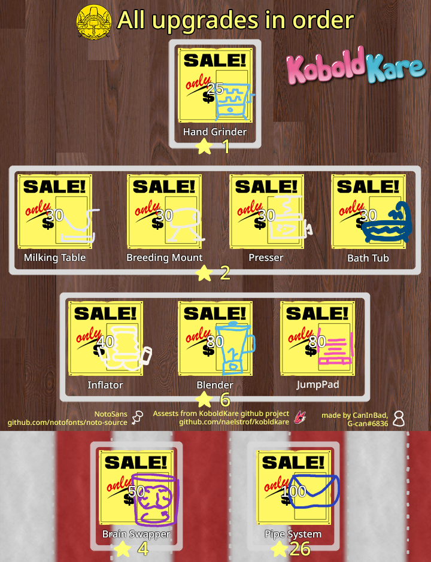
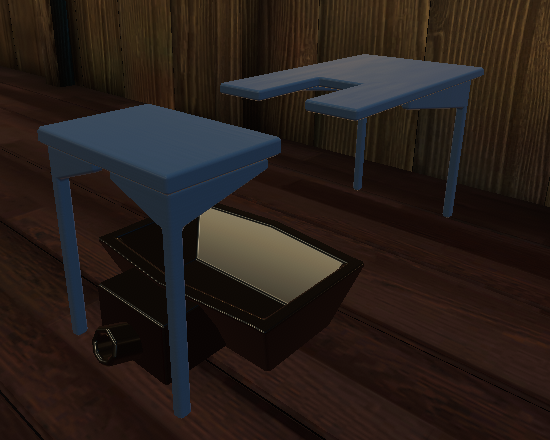
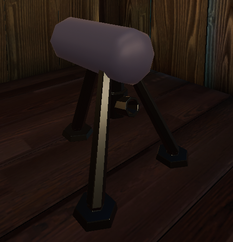
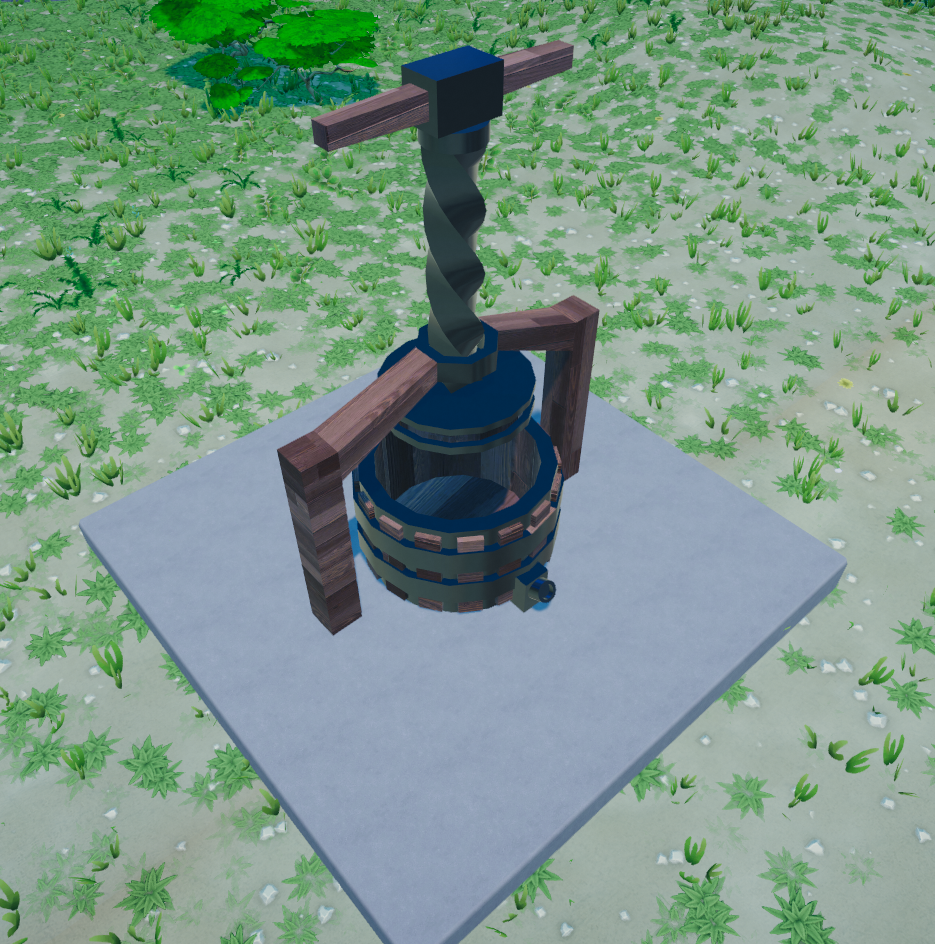
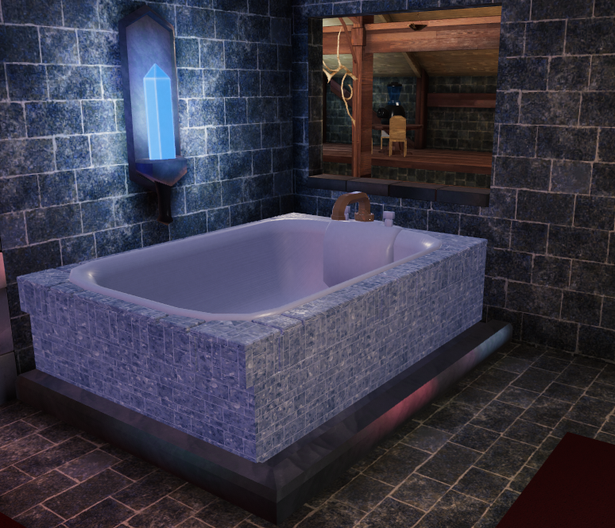
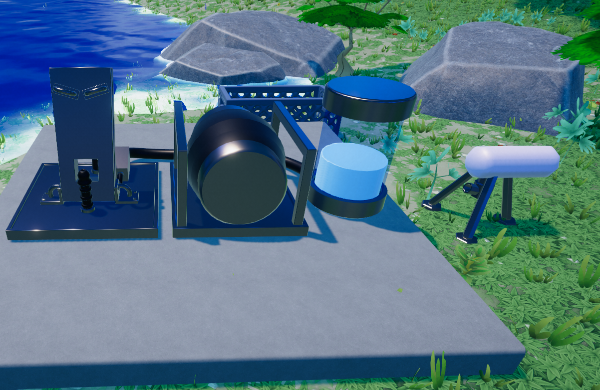
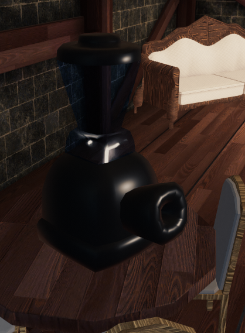
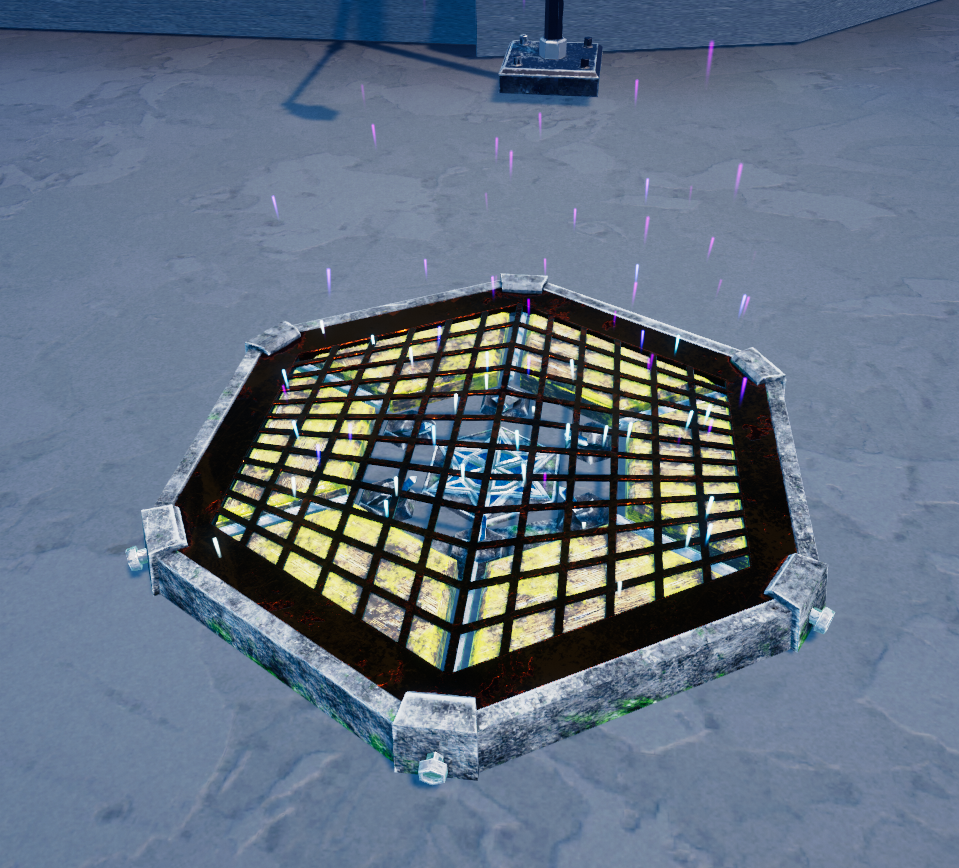
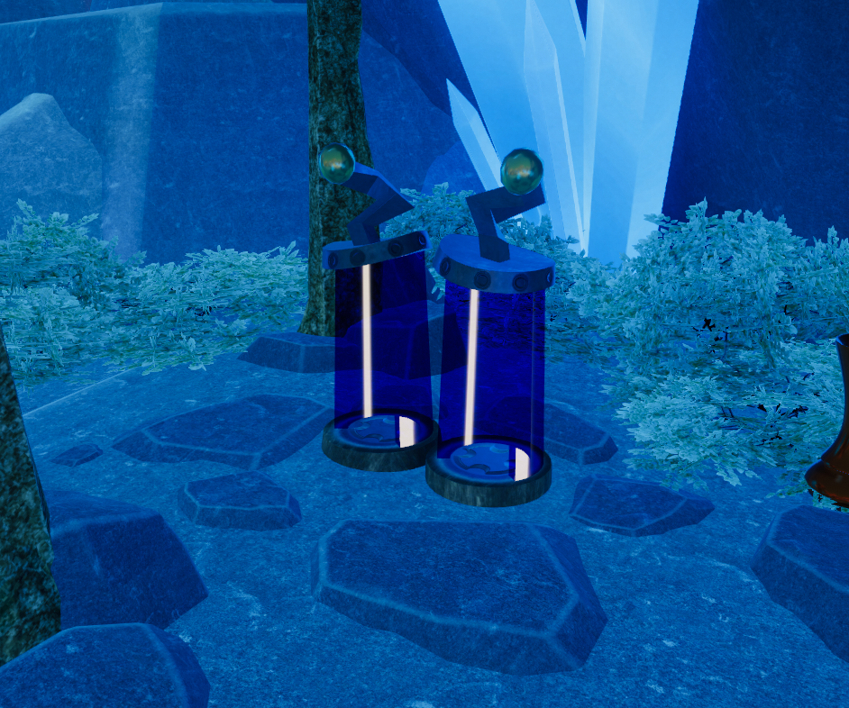
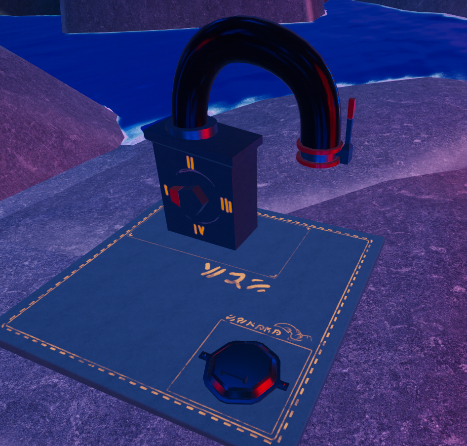

    
   All upgrades in order

This page lists all current available **upgrades** for purchases to the farm

## Tier 1

Requires to have 1 Star

### Hand Grinder

    
   Hand crank grinder in its natural habitat

#### Appearance

Upon buying, a grinder will appear to the right of the house inside the makeshift gazebo

**There are 3 main parts.**

- On top is an input slot
- Front of the machine output
- Intractable action to activate the machine

#### Description

A early-game grinder that use energy upon using, when turned on they stay on for ~18 seconds. While it is on, anything put on the machine will be grind into liquid that output in stream on the front.  
**Cost K\$25**  

## Tier 2

Requires to have 2 Stars

### Milking Table

    
   Milking Table inside the kitchen, or rather Hut 2

#### Appearance

Upon buying, it will appear inside one of the **[barn](Locations#Huts_1&2)**
 
There are 2 interactable spots
- spot for one getting milked
- spot for milking one on the table  

> [!NOTE]
> To access the milking spot there must be a kobold on the table already

#### Description

Milking table with support for both genders. Both side must have sufficient energy, when the condition is met then the kobold on the table will start lactating and use 1 energy.  
Also works as a buffer storage. Any liquid throw to it will be store and split out the front.  
**Cost K\$30**  

### Breeding Mount

    
   Breeding mount inside the kitchen

#### Appearance

Upon buying it will appear inside the same shed as **[milking table](#milking-table)**, and across **[the river](Locations#The_River)**  
Typical breeding mount used for equine semen collection, or this case kobold cum

- Interactable action
- Output out the front  
  (the back is where to put the penis)

#### Description

For only those with penis. Interacting to go on animation itself does not requires energy but the main function of it does. It doesn't matter if you interact with breeding mount or just standing behind the mount and move your hips it still stimulate penis the same way. Also works as a buffer storage. Any liquid throw to it will be store and split out the front.  
**Cost K\$30**  

### Presser

    
   Presser on the farm

#### Appearance

Upon buying it will appear to the right of the farm situated on gray concrete plate. Typical wine press used to squeeze a lot of grape, or this case squeeze a kobold.

- Interactable action
- Output out the front

#### Description

Upon interacting with the presser, one will be put on the presser. The presser will activate after ~8 seconds then the kobold will be put inside and liquid inside kobold start flowing out the front. Works as buffer storage. Any liquid throw to it will be store and split out the front  
**Cost K\$30**

### Bath tub

    
   Bath tub inside the house

#### Appearance

Upon buying it will appear inside the house in the bathroom. Generic bathtub with no way to overfill apparently

- Acts as liquid storage
- Interactable tap
- 2 interactable spots

#### Description

The bath tub has 100 unit liquid storage space, to store liquid you have to throw liquid at them. To recover the liquid you can use any containers. The tap can refill bath tub with water indefinitely. The tub has [a sex spot](Sex#Sex_animations).  
**Cost K\$30**  

## Tier 3

Requires to have 6 Stars

### Inflator

    
   Inflator across the river

#### Appearance

Upon buying it will appear across the river A machine/mechanism used to inject into one's abdomen, or in this case; the void inside a kobold.

There are 3 sections to the machine. When facing head on

- Interactable action
- Pump
- Tank

#### Description

When facing on, the left should be a spot where one can interact to sit in the injector. The middle is the pump, you can press and hold it to charge. Charging the pump will make it output more. Fully charge the pump takes ~5 seconds then it will fully use all the liquid in tank. Tank can store up to 120 unit of liquid. To the right of the machine should be a [breeding mount](#Breeding_Mount).  
**Cost K$40**

### Blender

    
   Blender inside the house

#### Appearance

Upon buying it will appear in both the [house](Locations#House) and [kitchen](Locations#Huts_1&2) Simple blender with output out the front

- Input on the top
- Output on the front

#### Description

This blender does not work like in real life, it will instantly grind anything put on top of the machine and output from the front. **The top sucks items in when they're nearby**  
**Cost K\$80**

### Jump Pad

    
   Jump pad in the town

#### Appearance

Upon buying it will appear in both [town](Locations#Town), near the [farm](Locations#the_farm) next to sell box, and the cliff next to the hut to get up to Brain Swapper. Sci-Fi jump pad that repulse you up in the sky in a predefined path

- The pad <!-- (duh) -->

#### Description

Jump pad that repulse you up in the sky in a predefined path  
**Cost K\$80**

## Cave Circus Shop

### Brain Swapper

    
   Brainswapper? Body switcher? Brain implant surgery?

Required 4 stars

#### Appearance

Upon buying it will appear behind the huts. Appears to be 2 tubes next to each other with tesla coils on top

#### Description

Tubes are interactables, when 2 valid subjects are in the tubes there will be 2-3 second delay before the swap happens  
**Cost K\$50**  

### Pipe System

    
   Buying kobold from other takekarer machine

Required 24 stars

#### Appearance

Dial knob on a cube connected to a curved tube

#### Description

The dial can be turned into 4 different positions,
1.  Micro
2.  Normal
3.  Big
4.  Large

The packages sizes are scaled with the knob's position.
Each position cost different ranging from **K$50-500**  
**Machine Cost K$100**