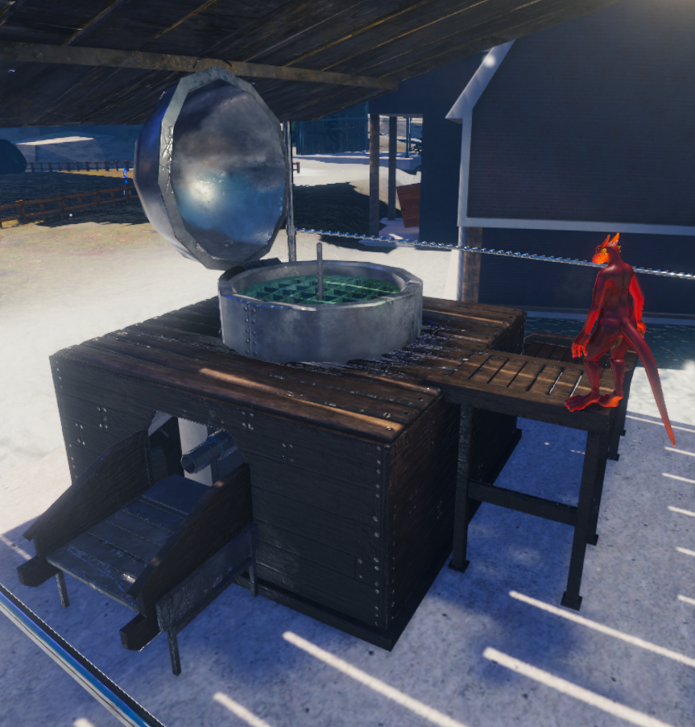
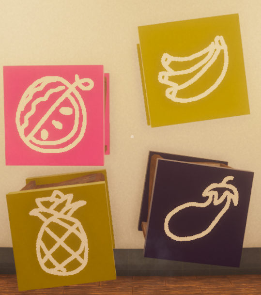
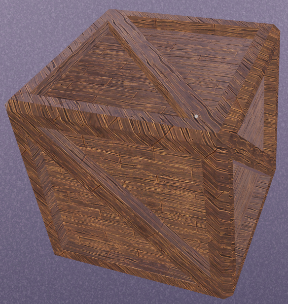
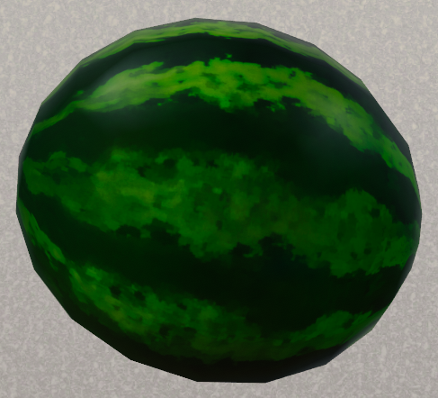
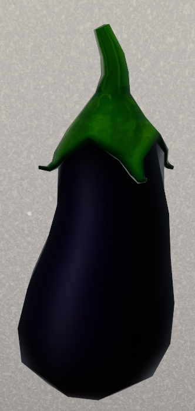
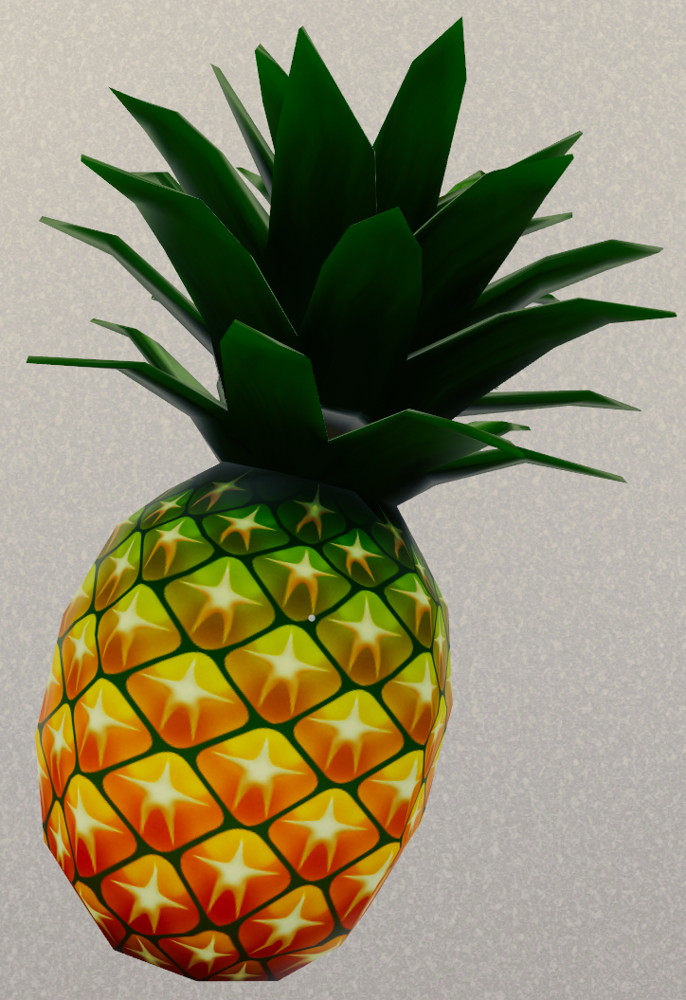
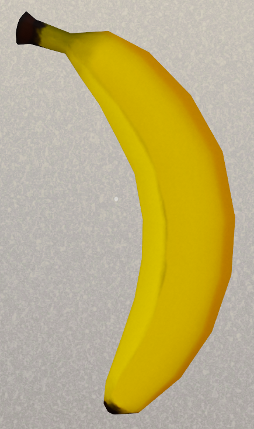

# Farming

In KoboldKare, you can grow kobolds and vegetables. To start, you will need seeds. Seeds are extracted from fruits in the Seed Extractor.

- Each fruit produces two seed boxes, and each seed will produce 4 plants.
- Due to the nature of seed extraction, bottles with enough reagent can be used to produce the related seed.

#### There are a limited amount of items that can be seeded

- Melons
- Eggplants
- Pineapples
- Bananas
- Kobold eggs, although this may be an error as they do not produce a crate, but rather more eggs.

The picture and color of a crate determines what is inside. Egg crates have no picture.

#### Other things cannot be made into seeds, but will be destroyed

- Hearts
- Ice
- Bombs (sometimes destroyed)
- Growth Potion
- Milkshake

|  |  |  |  |
| :- | :- | :- | :- |
|  |  |  |  |

# How to farm plants

Once you have your seed, you can plant it in available space in the farm plot. Plants and Kobolds have three stages: Initial, Intermediate, and fully grown. You must water them to move on to the next stage. Once fully grown, you should bring them into a safe space. Kobolds will succumb to *the night hands* if left out overnight.

### Stages and notes

<table>
  <thead>
    <tr>
      <th>
        
Growable
        

      </th>
      <th>
        
Stage 1 Appearance
        

      </th>
      <th>
        
Stage 2 Appearance
        

      </th>
      <th>
        
Stage 3 Appearance
        

      </th>
    </tr>
  </thead>
  <tbody>
    <tr>
      <td style="font-weight:bold;">
        
Kobold
        

      </td>
      <td>
        
An egg planted on the ground
        

      </td>
      <td>
        
The head and shoulders of a kobold
        

      </td>
      <td>
        
Varies: an NPC kobold
           
        

      </td>
    </tr>
    <tr>
      <td style="font-weight:bold;">
        
Melon
        

      </td>
      <td>
        
a disturbed dirt patch
        

      </td>
      <td>
        
A small long-leaf bush
        

      </td>
      <td>
        
vines with 4 melons
        

      </td>
    </tr>
    <tr>
      <td style="font-weight:bold;">
        
Eggplant
        

      </td>
      <td>
        
a disturbed dirt patch
        

      </td>
      <td>
        
A small long-leaf bush
        

      </td>
      <td>
        
short stocky plant with 4 eggplants
        

      </td>
    </tr>
    <tr>
      <td style="font-weight:bold;">
        
Pineapple
        

      </td>
      <td>
        
a disturbed dirt patch
        

      </td>
      <td>
        
A small long-leaf bush
        

      </td>
      <td>
        
due to error: no plant with 4 pineapples on a bare
          ground
        

      </td>
    </tr>
    <tr>
      <td style="font-weight:bold;">
        
Banana
        

      </td>
      <td>
        
a disturbed dirt patch
        

      </td>
      <td>
        
A small long-leaf bush
        

      </td>
      <td>
        
lanky plant with 4 bananas
           
        

      </td>
    </tr>
  </tbody>
</table>

Notes:

- You know when you have supplied enough water when you see hearts. On plants, stage two becomes shiny; kobolds close their eyes.
- You only need to supply water for the first two stages.
- All plants do not produce more after Stage 3. The plant body will disappear the following day.
- All watered plants progress to the next stage after the red bar passes
- [Weather](Weather "wikilink") effects plants. Rain will water your plant if it has not been already watered.

|  |  |

## Tools

**Sprayer:** Sprayers can be filled with all sorts of [liquids](../done/Items#liquids). Use the sprayer by holding it with right-click, and then shooting with left-click to dispense the internal liquid. Putting a sprayer in any body of water will fill the sprayer with water, but any liquid can be used to 'water' the plant. Sprayers can be purchased at the *[Town](../done/Locations#Town)* in town.

**Bomb:** If you need more space, use bombs to clear debris. Bombs can be purchased from the [Pawnshop](../done/Locations#Town)

Note: The potassium from bananas can be extracted into a sprayer and used as a bomb replacement. Simply spray a bottle with potassium in it with water. Any amount will cause it to explode after a moment. This will destroy the sprayer.

| |  |
