This is an iterative process and there's a lot of things that need to go right for a full-fledged character to be added to the game.

While there is a lot to do, we can take it in steps, and not everything needs to be done at once. You might want to start with [Installing the KoboldKare SDK](../done/Installing_the_KoboldKare_SDK) if you haven't yet.

## Get your hands on a 3D model

First you'll need a character, either you can make one or commission one, but in the end you'll need a 3D character with the capacity to edit it.

This tutorial will assume you have a game-ready, rigged and textured 3D model within Blender like so.

   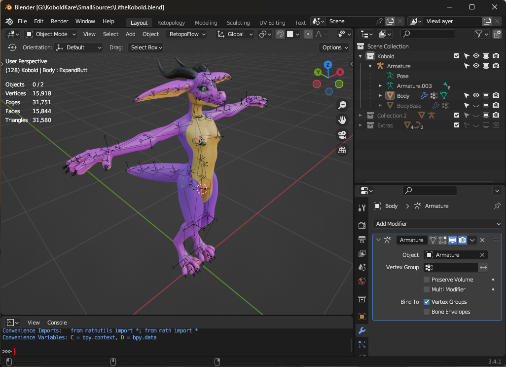 
   Blender_lilith.png

  

### Ensure the model is facing the correct direction

Blender exports FBX files as -Y being the forward direction.

   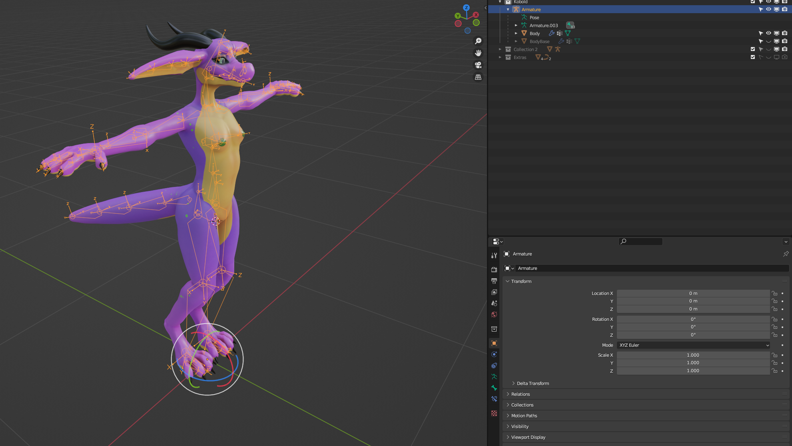 
   Lilith_facing_direction.png

Pay attention to the gizmo in the upper right, it shows which way the character should be facing (the -Y direction).

You may also need to Apply All Transformations so that both the Armature and the meshes are neutrally rotated (0 rotation on all axis) facing -Y.

## Import the character into Unity

Unity doesn't import Blend files for characters very well, we need more fine control than that.

### Select both the Body and Armature, then export them together as an FBX with the following settings

   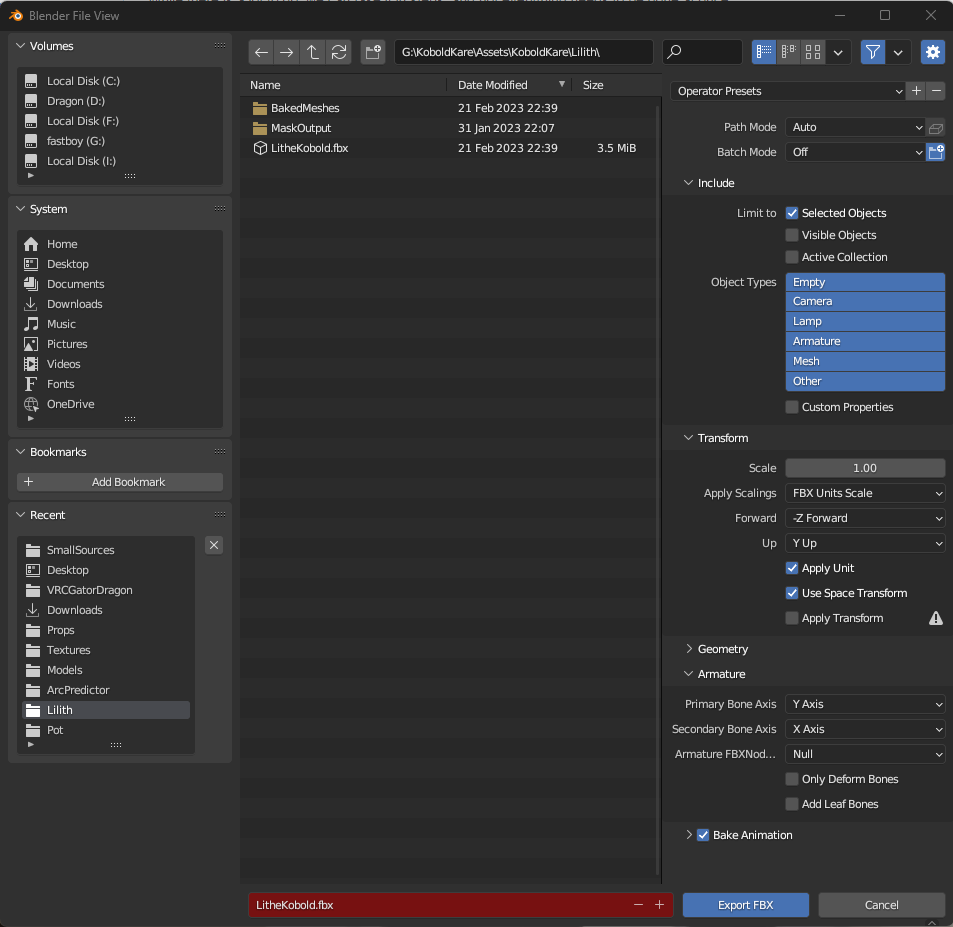 
   Blender_export_fbx_settings.png

Namely we need to make sure that Apply Scalings is set to FBX Units Scale, and that Add Leaf bones is turned off.

It's also nice to have the export targeting a folder within the KoboldKare Assets for quick model iteration.

### Change the fbx model import settings within Unity, using the inspector

- Legacy Blendshape Normals: ☒
- Normals: Import
- Generate Lightmap UVs: ☒

    
   Unity_fbx_import_model_tab.png

### Create Humanoid Avatar

The model we imported must have a Humanoid avatar in order to work with KoboldKare, this can be done on the Rig tab of the import settings in the inspector.

   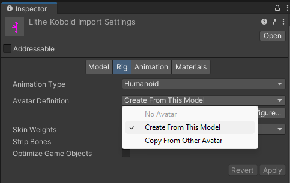 
   Lilith_humanoid_avatar_tab.png

Select Create From This Avatar, then hit apply.

### Configuring the Humanoid Avatar

Hit Configure on the humanoid avatar, and ensure that all the bones are set up in a way that makes sense. You can find extra information on configuring avatars from the Unity Manual here: [Unity Manual ConfiguringtheAvatar](https://docs.unity3d.com/Manual/ConfiguringtheAvatar.html)

   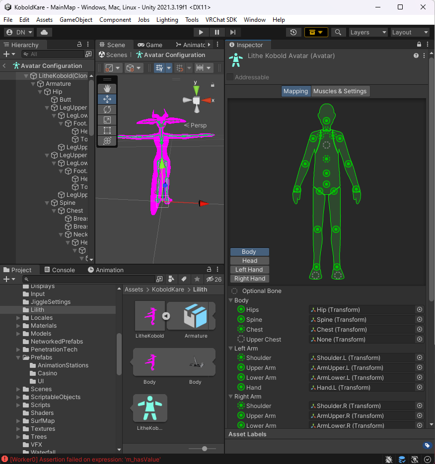 
   Lilith_humanoid_avatar_configure.png

### Setting up Materials

KoboldKare uses standard metallic PBR maps for its shaders, however it also has some extra features that are optional that I'll try to cover. Create fresh materials by right-clicking in the Project tab and click "Create → Material" for each material necessary for your character.

For the Body of your character, you'll want to use the [Kobold Shader](Kobold_Shader). Fill out the maps that you have, leave DecalColorMap blank as that's used for decals.

    
   Lilith_kobold_shader.png

Eyes optionally can be done with [Vilar's EyeV2 Shader](Vilar's_EyeV2_Shader), which is fairly complicated.  
Though you can get a wide variety of eye types with it.

   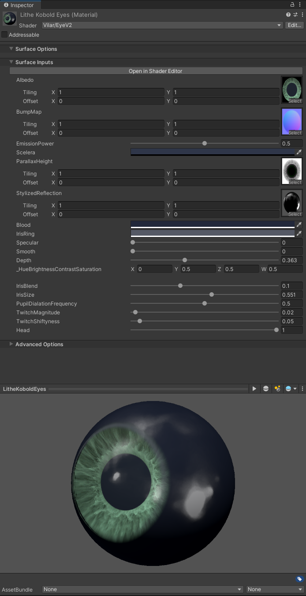 
   Lilith_eye_shader_config.png

With your materials created, set them up on the Materials tab of your character's FBX importer:

   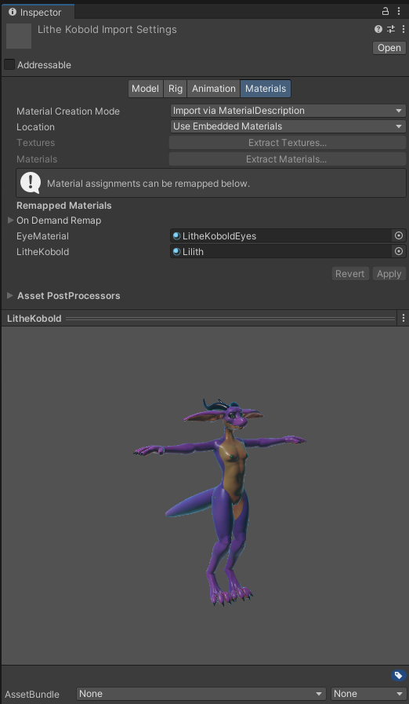 
   Lilith_fbx_import_materials.png

## Turning an imported FBX into a playable character

Now that the model is usable within Unity itself, we can start to setup the character to be a playable one.

   <a href="../images/getting-started-with-character-modding/CreatingLilithPrefab.mp4">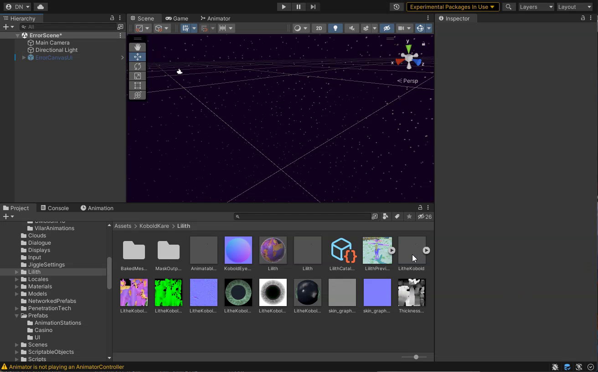 
   Click to watch the video</a>

### Creating the prefab

We don't want to work on the model directly, so first we create a parent empty `gameObject`, place the fbx at the center of it, and turn it into a prefab by dragging it into the Project tab.

### Adding the Character Descriptor

With the root of the prefab selected, or with the prefab selected in the Project tab, click "Open" under the inspector.

   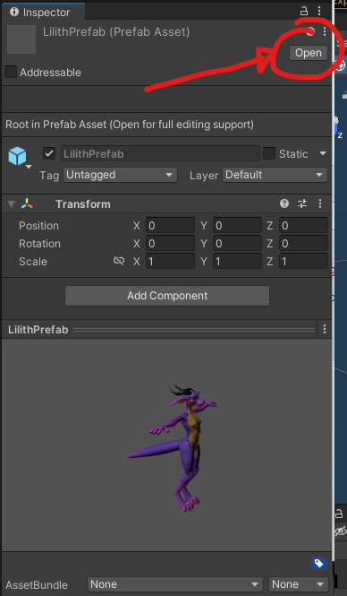 
   Lilith_open_prefab.png

Then with the root of the prefab selected within the hierarchy, add a new Character Descriptor component from within the inspector.

   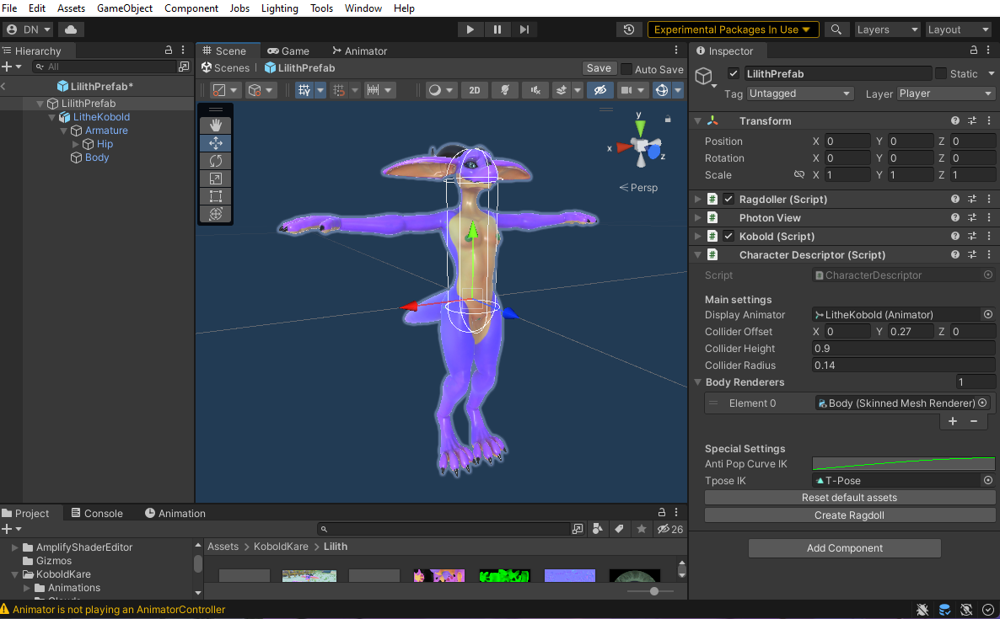 
   Configured_lilith_character_descriptor.png

You'll want to configure the Collider settings to match the torso and head of the character.

Also set the Body Renderers list to all LOD0 renderers of the character, if you don't know what LOD0 means, simply put all the renderers in.

### Configuring the bare-minimum

In order for dicks to be attachable to the character, you must manually add a Crotch attach point.

Simply create an empty on the hip, and position it roughly here. Z-forward, Y-up.

   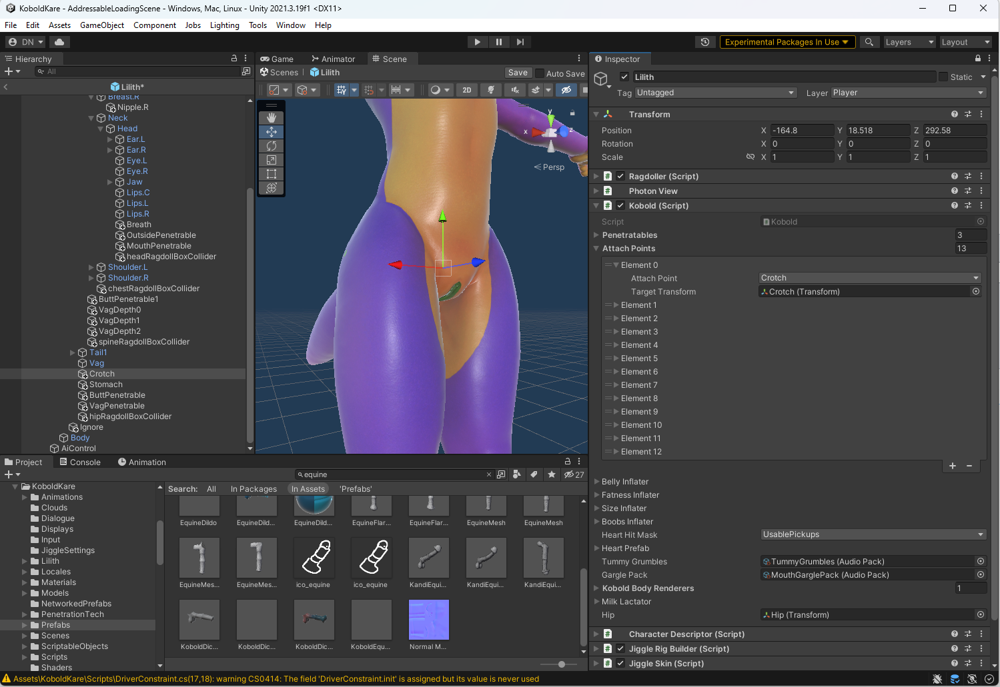 
   Lilith_crotch_attach_point.png

Sorry there's no way in the current build to preview what dicks look like when they're attached to it. See this [issue](https://github.com/naelstrof/KoboldKare/issues/224) for checkin if this has been fixed or not.

You'll also need to create nipple locations. You can simply create empties near where the nipples are. This time Y-Forward, for no particular reason, sorry!

   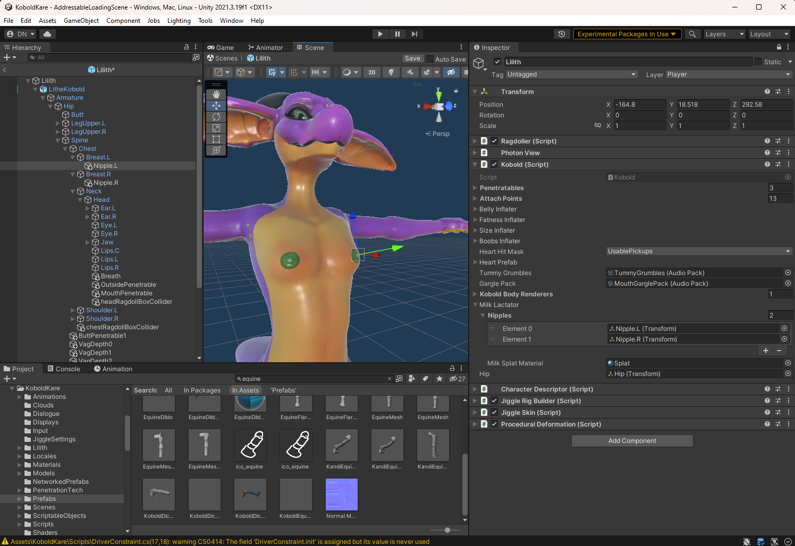 
   Lilith_nipple_configuration.png

Make sure to add each empty to the Milk Lactators, if you have more than two nipples, you can add all of them!

## Testing it in game

Next up, we need to set up a very basic Unity Addressables Asset Group in order to have KoboldKare recognize it as a playable character. This is very easy.

1. Select the prefab within the project tab.
2. With your character prefab selected, check "Addressable" within the inspector.

   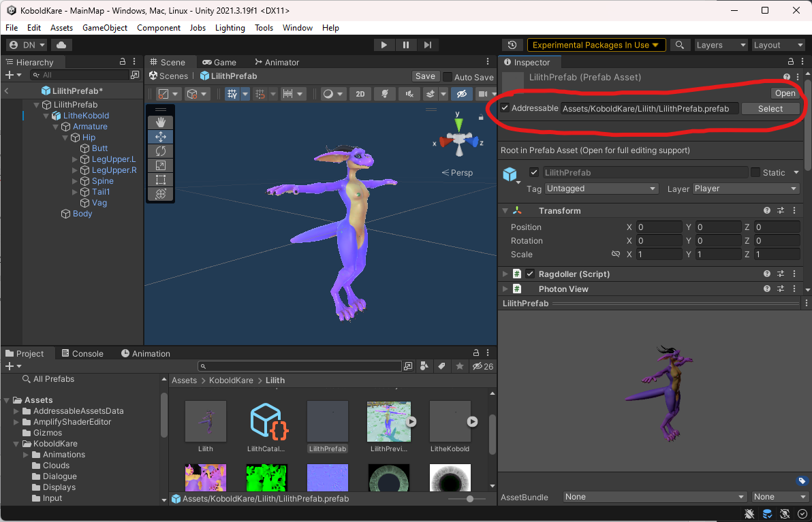 
   Addressable_setup_lilith.png

3. Click Select next to the Addressable address in order to open up the Asset Groups.
4. Add a new label to the addressable, we want to specify a character as a "PlayableCharacter".

   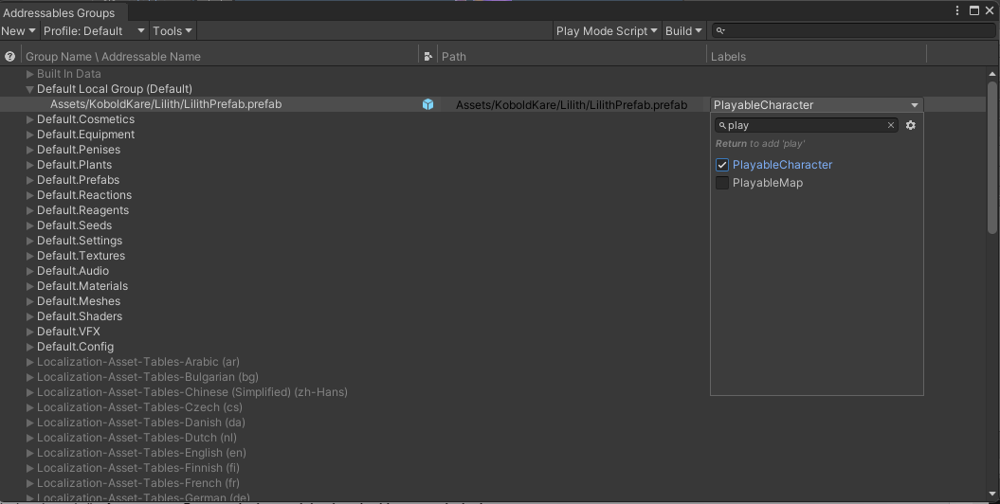 
   Addressable_playable_character_lilith.png

5. Finally move it to a unique group, treat each group like an individual "mod" bundle.

   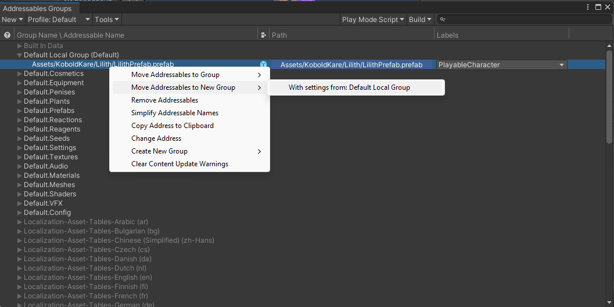 
   Addressable_move_Lilith_to_new_group.png

6. Feel free to use whatever address you like for your character, though KoboldKare currently keys characters by their prefab name. Meaning that this character will always be named "LilithPrefab" until you change the name of the prefab.
7. Finally, load the MainMenu scene (Found in KoboldKare/Assets/Scenes/MainMenu.unity), as you should be able to spawn-in your character within the options!

   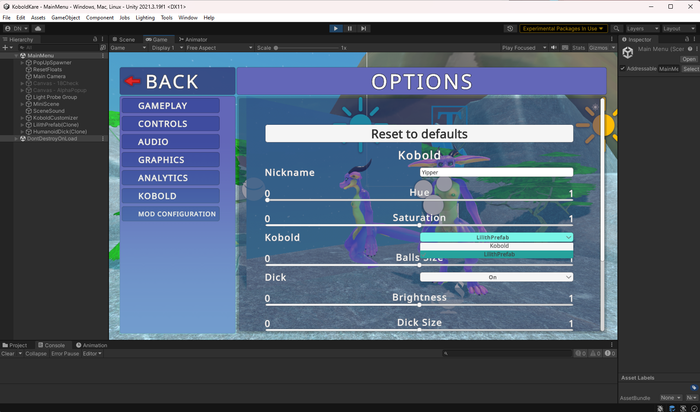 
   Lilith_working_in_game.png

## Where to go from here

While we managed to get the character in-game, there's a lot missing still. On the bright side we can implement each missing feature iteratively, and even check out how it looks at each step.

Some of these steps are not required, though I highly recommend them:

- [Setting up JigglePhysics](Setting_up_JigglePhysics "wikilink")

