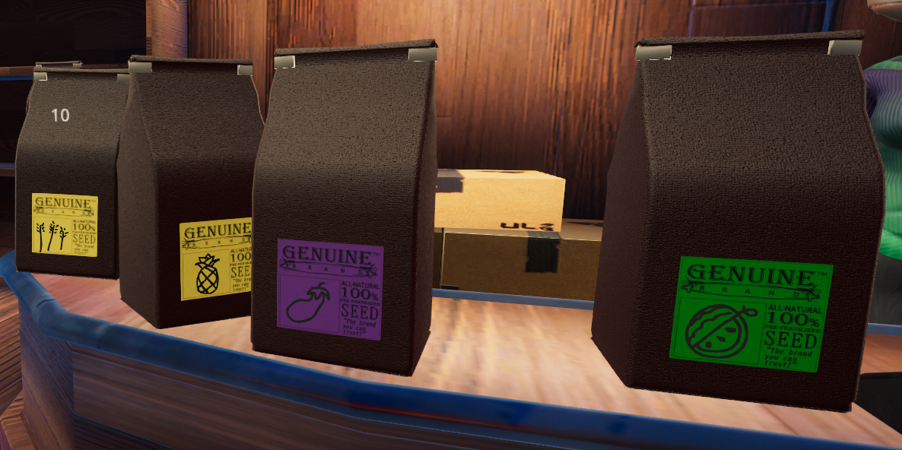
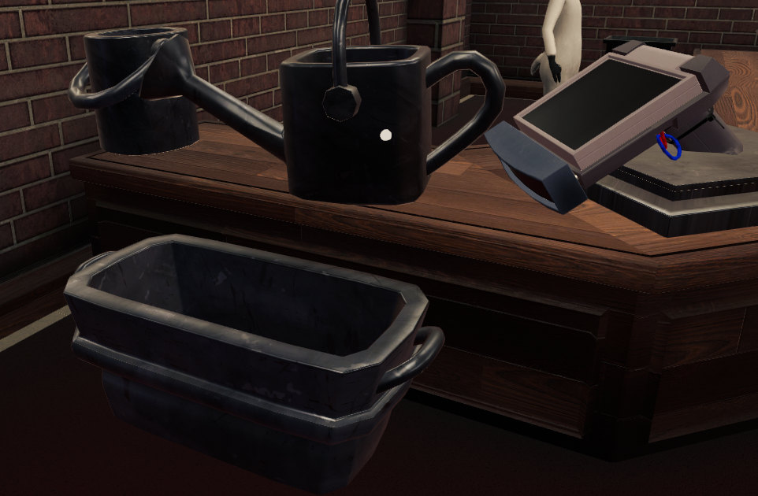

## Supplies

- **Egg:** Can be purchased from *[Macromart](Locations#Town)* for $5 or laid after metabolizing Cum or Love. Purchased eggs have 20 units of scrambled eggs in them and eggs Kobolds laid have a minimum of 25 units.
- **Melon:** Can be found in *[The Forest](Locations#Forests)* or grown on your farm from seeds ($15). When you grind them you get pink Melon Juice which causes breast grow.
- **Eggplant:** Can be found in *[The Forest](Locations#Forests)* or grown on your farm from seeds ($10). When you grind them you get purple Eggplant Juice which causes penis growth.
- **Pineapple:** Can be found in *[The Forest](Locations#Forests)* or grown on your farm from seeds (\$10). When you grind them you get yellow Pineapple Juice which causes ball growth.
- **Mushroom:** They can be found in *[The Caves](Locations#Cave)*. When you grind them you get pink Mushroom Juice which makes Kobolds shrink and lose saturation.
- **Wheat:** Can only be grown on your farm from seeds (\$10). Becomes flour when ground.
- **Banana:** Can only be found in *[The Forest](Locations#Forests)*. Becomes Potassium when ground.
- **Heart:** Hearts act as cum for Kobolds without a dick and will spawn upon climax. 10 units of Love is added to the Heart if they or another Kobold without a dick cum again near it. (on Love.) The genetic material in the Heart is set to who ever came near it last.
- **Ice:** Can be bought from the *[Tool Store](Locations#Town)* for \$20. Used in recipes.
- **Seeds:** Bought at *[Macromart](Locations#Town)* in town. Used for [Farming](Farming). One seed packet will yield 2 - 3 fruits.

See [Liquids](Items#Liquids) for more details and recipes.

|Heart Fruit|Ice|Seed bags|
| :-: | :-: | :-: |
|  |  |  |

<!-- Heart.png\|Heart Fruit.PNG\|fruits ice.png\|Ice Seeds.PNG\|Seed bags -->

## Tools

- **Bucket:** Buckets can be filled with all sorts of [Liquids](#Liquids). Use the Bucket by holding it with right-click, and then shooting with left-click to feed the Kobolds.  
  Buckets can be purchased at the *[Macromart](Locations)* in town for \$15. Contains 20 units of liquid.

- **Watering can:** Watering cans can be filled with all sorts of [Liquids](#Liquids). Use the Watering can by holding it with right-click, and then shooting with left-click to feed the Kobolds.  
  Watering Cans can be purchased at the *[Tool Store](Locations)* in town for \$50. Contains 30 units of liquid.

- **Trough:** Troughs can be filled with all sorts of [Liquids](#Liquids). Use the trough by holding it with right-click, and then shooting with left-click to feed the Kobolds.  
  Troughs can be purchased at the *[Tool Store](Locations)* in town for \$25. Contains 60 units of liquid.

- **Dildos:** These are used to show your Kobolds just how much you love them. If used on a Kobold long enough they will spawn a heart or cum.  
  Can be purchased at the *[Pawnshop](Locations)* for \$50 each. Currently they are only available in a standard XL size. Throwing any [Liquids](#Liquids) on them increases their size.

- **Bomb:** Bombs are used to clear the farm plots from rocks. To explode a Bomb, look for the  symbol and use it to activate. Since they are potassium explosions, they can be ground in the grinder for their potassium. They are available for purchase at the *[Pawnshop](Locations)* for \$200.

- **Scanner:** The Scanner is used to measure the contents of many items, including but not limited to:  
  - Kobolds
  - buckets
  - watering cans
  - Troughs
  - What is left in the grinder
  - What is left inside the seed extractor
  - What is inside a kobold (Both what make up a kobold and what had yet to be metabolized, currently there is no separation)
  - Units in melons, eggplants, love, eggs, and more.

  The scanner can be purchased from the *[Tool Store](Locations)* for \$25.

|Bomb|Tools|
|:-:|:-:|
|  |  |

<!-- Bomb.png\|Bomb Tools.PNG\|tools -->

## Liquids

This includes Alchemy and 'Cooking'.

### Origin and effects

<!-- This is going to be a nightmare to cleanup :sob: -->

<table>
  <colgroup>
  <col style="width: 5%" />
  <col style="width: 15%" />
  <col style="width: 10%" />
  <col style="width: 1%" />
  <col style="width: 10%" />
  <col style="width: 30%" />
  </colgroup>
  <thead>
      <tr>
          <th>Name</th>
          <th>Origin</th>
          <th>Effect/Use</th>
          <th>Calories</th>
          <th>Appearance</th>
          <th>Notes</th>
      </tr>
  </thead>
  <tbody>
      <tr>
          <th>Water</th>
          <td>From the shower, tub, river, or fountain.</td>
          <td>Watering Crops or eggs. Cleaning kobolds</td>
          <td>0</td>
          <td style="background:#424D53">
HEX #424D53 RGB 66,77,83 Light Blue Liquid
</td>
          <td>It can clean up other liquid decals</td>
      </tr>
      <tr>
          <th>Melon Juice</th>
          <td>Melon</td>
          <td>Breast Growth</td>
          <td>0.05</td>
          <td style="background:#CA58B4">HEX #CA58B4 RGB 202,88,180 Pink Liquid</td>
          <td>Used as a reagent.</td>
      </tr>
      <tr>
          <th>Eggplant Juice</th>
          <td>Eggplant</td>
          <td>Increase penis size and stimulation rate.</td>
          <td>0.05</td>
          <td style="background:#8236D2">
HEX #8236D2 RGB 130,54,210 Purple Liquid
</td>
          <td>Grinding a dildo gives 10 Eggplant Juice. Used as a reagent.</td>
      </tr>
      <tr>
          <th>Pineapple Juice</th>
          <td>Pineapple</td>
          <td>Increase scrotum size and cum production.</td>
          <td>0.05</td>
          <td style="background:#C3B069">HEX #C3B069 RGB 195,176,105 Yellow Liquid</td>
          <td>This will not give balls to a Kobold who does not already have a pair, but will increase cum volume in a tapered Kobold. Used as a reagent.</td>
      </tr>
      <tr>
          <th>Mushroom Juice</th>
          <td>Mushroom</td>
          <td>Body shrinks Decreases saturation</td>
          <td>0.05s</td>
          <td style="background:#C29E73">HEX #C29E73 RGB 194,158,115 Black Liquid</td>
          <td>Don't put this in a Kobold with fruit juice already inside, it will mix and shrink only the part you want to grow. Used as a reagent.</td>
      </tr>
      <tr>
          <th>Dick-shrink</th>
          <td>One part Mushroom One part Eggplant</td>
          <td>Shrinks dick</td>
          <td>0.05</td>
          <td style="background:#524332">HEX #524332 RGB 82,67,50 Black Liquid</td>
          <td>Does what it said</td>
      </tr>
      <tr>
          <th>Balls-shrink</th>
          <td>One part Mushroom One part Pineapple</td>
          <td>Shrinks balls</td>
          <td>0.05</td>
          <td style="background:#524332">HEX #524332 RGB 82,67,50 Black Liquid</td>
          <td>Reduces cum output Does what it said</td>
      </tr>
      <tr>
          <th>Boob-shrink</th>
          <td>One part Mushroom One part Melon</td>
          <td>Shrinks breast</td>
          <td>0.05</td>
          <td style="background:#524332">HEX #524332 RGB 82,67,50 Black Liquid</td>
          <td>Reduce milk output Does what it said</td>
      </tr>
      <tr>
          <th>Cum</th>
          <td>Dicks</td>
          <td>Metabolizes into eggs</td>
          <td>0.001</td>
          <td style="background:#C6C6C6">HEX #C6C6C6 RGB 198,198,198 Cum filled condom</td>
          <td>The amount produced depends on the size of the Balls. Transform into a filled condom model with >= 5 units existing in a container. Used as a reagent.</td>
      </tr>
      <tr>
          <th>Love</th>
          <td>Heart</td>
          <td>Metabolizes into eggs.</td>
          <td>0.001</td>
          <td style="background:#D63F4F">HEX #D63F4F RGB 214,63,79 Red Liquid</td>
          <td>Used as a reagent.</td>
      </tr>
      <tr>
          <th>Egg</th>
          <td>Metabolized Love or Cum</td>
          <td>Able to use egg laying animations</td>
          <td>N/A</td>
          <td style="background:#CCBC5C">HEX #CCBC5C RGB 204,188,92 Green Liquid</td>
          <td>Cum metabolizes into eggs at a ratio of 1 cum:4 egg. Ex: 5 units of cum will turn into 20 units of egg Minimum of 5 units are required to lay an egg.</td>
      </tr>
      <tr>
          <th>Growth Serum</th>
          <td>one part Incomplete Growth Serum one part Missing Reagent (either melon if you already put eggplant and vise-versa)</td>
          <td>Increase Kobold's overall size</td>
          <td>0.10</td>
          <td style="background:#00D610">HEX #00D610 RGB 0,214,16 Bright Green Liquid</td>
          <td>Currently, Eggplants and melons are 20 units, but love is 10 units. A balanced formula requires 2 hearts, 1 Eggplant, and 1 Melon sprayed into another Eggplant. This nets 80 units.</td>
      </tr>
      <tr>
          <th>Incomplete Growth Serum</th>
          <td>One part Love and one part Melon (for variant A) <b>OR</b> One part Love and one part Eggplant (for variant B)</td>
          <td>N/A</td>
          <td>0.10</td>
          <td style="background:#003C00">HEX #003C00 RGB 0,60,0 Bright Green Liquid</td>
          <td>Comes from an imbalanced growth juice. Can be fixed by adding the missing reagent.</td>
      </tr>
      <tr>
          <th>Milk</th>
          <td>Breasts</td>
          <td>N/A</td>
          <td>0.12</td>
          <td style="background:#C6C6C6">HEX #C6C6C6 RGB 198,198,198 Light Blue Liquid</td>
          <td>Amount produced scales with breasts size. Perfect for early game energy supply. Used as a reagent.</td>
      </tr>
      <tr>
          <th>Ice</th>
          <td>Ice</td>
          <td>N/A</td>
          <td>0</td>
          <td style="background:#9ECDCD">HEX #9ECDCD RGB 158,205,205 Light Blue Liquid</td>
          <td>Used as a reagent.</td>
      </tr>
      <tr>
          <th>MilkShake</th>
          <td>One part Milk One part Ice</td>
          <td>N/A</td>
          <td>0.30</td>
          <td style="background:#83ACA9">HEX #83ACA9 RGB 131,172,169 A glass with whipped cream and a cherry on top</td>
          <td>Transform to milkshake model with >= 5 units existing in a container.</td>
      </tr>
      <tr>
          <th>Scrambled Egg</th>
          <td>Eggs</td>
          <td>N/A</td>
          <td>0.10</td>
          <td style="background:#CCBC5C">HEX #CCBC5C RGB 204,188,92 Green Liquid</td>
          <td>Used as a reagent.</td>
      </tr>
      <tr>
          <th>Potassium</th>
          <td>Bananas or Bombs</td>
          <td>N/A</td>
          <td>0</td>
          <td style="background:#D6D6D6">HEX #D6D6D6 RGB 214,214,214 White Liquid</td>
          <td>Used as a reagent.</td>
      </tr>
      <tr>
          <th>Explosion</th>
          <td>One part Potassium One part Water</td>
          <td>Explosion</td>
          <td>0</td>
          <td style="background:#000000">HEX #000000 RGB 0,0,0 Black Liquid</td>
          <td>1 unit potassium plus 1 unit water makes 2 units of explosion. For now, any amount of explosion is the same strength. Any amount of explosion will remove all contents of the container and surrounding items, be it a bucket, grinder, tub, or anything inside a kobold not yet metabolized. Containers can only explode once. If the container is a crop or dildo, it is destroyed upon explosion.</td>
      </tr>
      <tr>
          <th>Banana Split</th>
          <td>one part Potassium one part Milkshake</td>
          <td>N/A</td>
          <td>0.50</td>
          <td style="background:#CCC3B0">HEX #CCC3B0 RGB 204,195,176 Traditional Banana Split </td>
          <td>Transform to banana boat ice cream model with >= 5 units existing in a container</td>
      </tr>
      <tr>
          <th>Ground Beef</th>
          <td>Activating a fish found in The River</td>
          <td>+1 Carry capacity</td>
          <td>0.10</td>
          <td style="background:#933A46">HEX #933A46 RGB 147,58,70 Black Liquid</td>
          <td>Extra max grab is sometimes annoying. Only requires 5 units metabolized to increase max carry.</td>
      </tr>
      <tr>
          <th>Dough</th>
          <td>one part Flour one part Water</td>
          <td>N/A</td>
          <td>0.10</td>
          <td style="background:#D6C48E">HEX #D6C48E RGB 214,196,142 A ball of dough</td>
          <td>Used as a reagent Transform into dough model with >= 5 units existing in a container.</td>
      </tr>
      <tr>
          <th>Burger</th>
          <td>One part Ground Beef One part Dough</td>
          <td>+1 Carry capacity</td>
          <td>0.50</td>
          <td style="background:#BC9B52">HEX #BC9B52 RGB 188,155,82 Black Liquid </td>
          <td>Extra max grab is sometimes annoying Transform to burger model with >= 5 units existing in a container. Only requires 5 units metabolized to increase max carry.</td>
      </tr>
      <tr>
          <th>Pie</th>
          <td>One part Melon One part Dough</td>
          <td>+ Breast size & instant lactation</td>
          <td>0.20</td>
          <td style="background:#D67CD1">HEX #D67CD1 RGB 214,124,209 Pie in a tin</td>
          <td>Transform into pie model with >= 5 units existing in a container. Does not contribute to metabolism bar for Breast growth. Activates every 10 units metabolized.</td>
      </tr>
      <tr>
          <th>Eggnog</th>
          <td>one part Scrambled egg one part Milk</td>
          <td>N/A</td>
          <td>0.20</td>
          <td style="background:#B2A68F">HEX #B2A68F RGB 178,166,143 Foamy liquid and cinnamon stick in a mug.</td>
          <td>Transform into eggnog model with >= 5 units existing in a container.</td>
      </tr>
      <tr>
          <th>Cake</th>
          <td>one part Eggnog one part Flour</td>
          <td>+1 Max energy per generation</td>
          <td>0.50</td>
          <td style="background:#D67CD1">HEX #D67CD1 RGB 214,124,209 A pink cake with one candle.</td>
          <td>One of the most effective to gain fat Transform into cake model with >= 5 unit existing in a container. Only requires 5 units metabolized to increase max Energy.</td>
      </tr>
      <tr>
          <th>Pineapple Popsicle</th>
          <td>one part Pineapple one part Ice</td>
          <td>+ Ball size &amp;amp; instant orgasm</td>
          <td>0.20</td>
          <td style="background:#D6D686">HEX #D6D686 RGB 214,214,134 A yellow popsicle.</td>
          <td>Transform into pineapple popsicle model with >= 5 unit existing in a container. Does not contribute to metabolism bar for ball growth. Activates every 10 units metabolized.</td>
      </tr>
      <tr>
          <th>Yogurt</th>
          <td>one part Semen one part Milk</td>
          <td>+1 Max metabolism per generation</td>
          <td>0.025</td>
          <td style="background:#84679D">HEX #84679D RGB 132,103,157 A cup of yogurt with some raspberries and a spoon.</td>
          <td>Can only metabolize 20 units per generation Transform into yogurt model with >= 5 units existing in a container.</td>
      </tr>
      <tr>
          <th>Egg Dinner</th>
          <td>one part Scrambled Egg one part Dough</td>
          <td>N/A</td>
          <td>0.20</td>
          <td style="background:#CCBC5C">HEX #CCBC5C RGB 204,188,92 Omelette with American cheese and 2 slices of toast on a plate.</td>
          <td>Transform into omelet with bread on a plate model with >= 5 units existing in a container</td>
      </tr>
  </tbody>
</table>

> [!NOTE]
> The lighting makes all mushrooms' liquid looks black, the color is from HUD elements instead

<b>Due to one reason or another, there is two liquids that can no longer be made + 1 extra not available without cheats:</b>

<table>
    <thead>
        <tr>
            <th>Legacy Liquid</th>
            <th>Origin</th>
            <th>Effect/Use</th>
            <th>Appearance</th>
            <th>Notes</th>
        </tr>
    </thead>
    <tbody>
        <tr>
            <th>Blood (Kobold)</th>
            <td>Ground Kobolds</td>
            <td>Unknown</td>
            <td>Pink/variable</td>
            <td>Grinding kobolds is not possible in the current version. Anything not yet metabolized in the kobold was also part of the mixture.</td>
        </tr>
        <tr>
            <th>Wood</th>
            <td>Ground door</td>
            <td>Unknown</td>
            <td>brown</td>
            <td>Grinding doors is possible in the current version however nothing comes out.</td>
        </tr>
        <tr>
            <th>Fat</th>
            <td>Unknown</td>
            <td>Unknown</td>
            <td>HEX #CCBC5C RGB 204,188,92</td>
            <td>VERY slow to digest, does not give any energy</td>
        </tr>
    </tbody>
</table>

### Liquid Notes

- All liquids increase belly size when ingested. Most of which will get metabolized out. The exceptions are Eggs, Yogurt after metabolizing 20 units, and body altering juice that after the Metabolism bar is full (Pie and Pineapple Popsicle excluded).
- Metabolizing liquids that give energy while the energy bar is full increases fat. Fat can be lost from using up your energy multiple times.
- Eggplant and Pineapple juice increase still genetically increase stats even if the Kobold doesn't have a penis or balls. Their offspring can still inherit these genes.
- Things sprayed into the grinder are re-dispensed, Including rain water.
- Grinding multiple compatible reagents in the grinder will combine them.
- The tub can be used to mix liquids, but be warned: pulling the drain plug will drain all current contents.
- No juice is produced from grinding:
  - The scanner
  - Empty Containers
- As of 2/10/2021, Kobolds cannot be ground in the grinder.
  - As Kobolds are no longer able to be gibbed, they are not vulnerable to explosions. Spraying them with water and potassium allows them to become one time explosives, able to efficiently clear the field of rocks.
- Any liquid can be used to "water" eggs and grounded kobolds, as well as plants.
- The Watering Can's model doesn't change if it holds a model transforming liquid.
  - Makes collecting Cum from *[Breeding Mounts](Farm_Upgrade#Breeding_Mount)* much easier.

## References

["Kobold Cookbook"](https://steamcommunity.com/sharedfiles/filedetails/?id=2861940679) posted by Shotgun Crusader, December 18th, 2022.

[Steam User Guide](https://steamcommunity.com/app/1102930/guides/)

