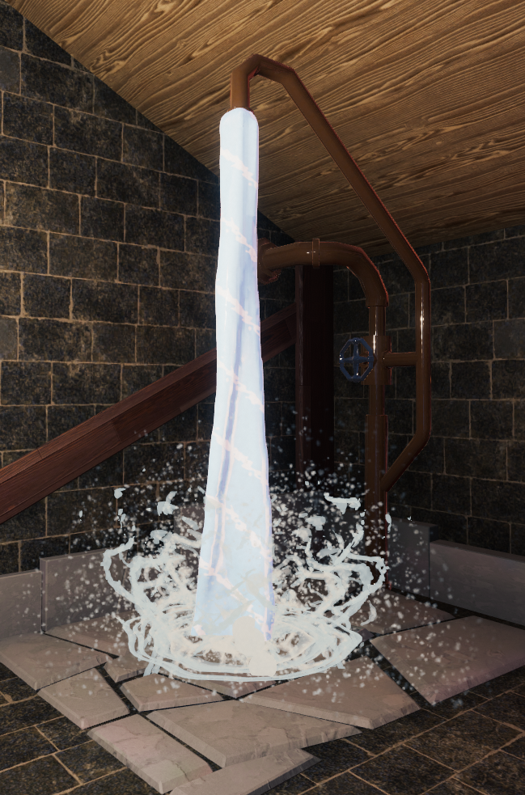
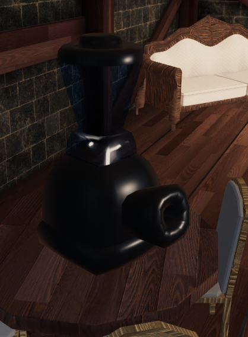
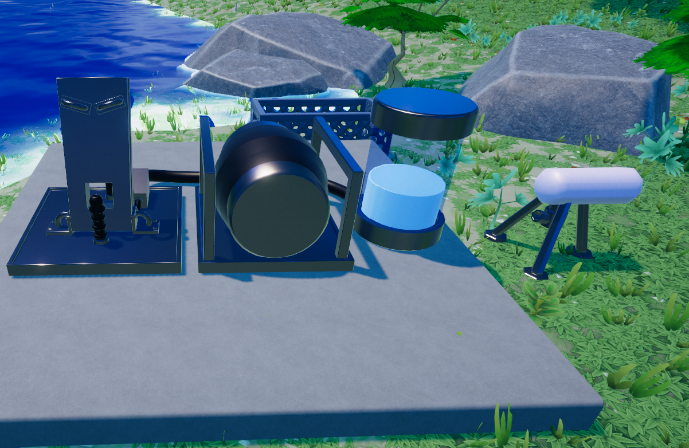
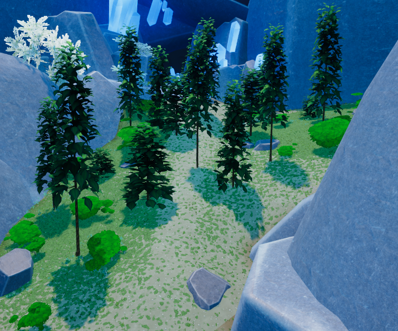
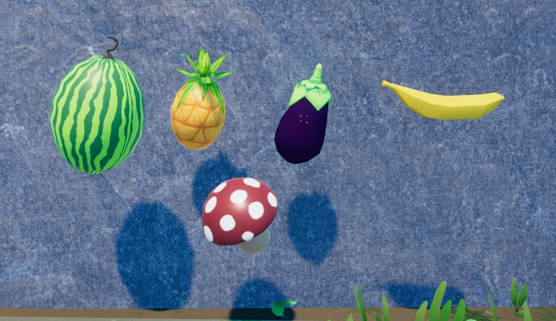
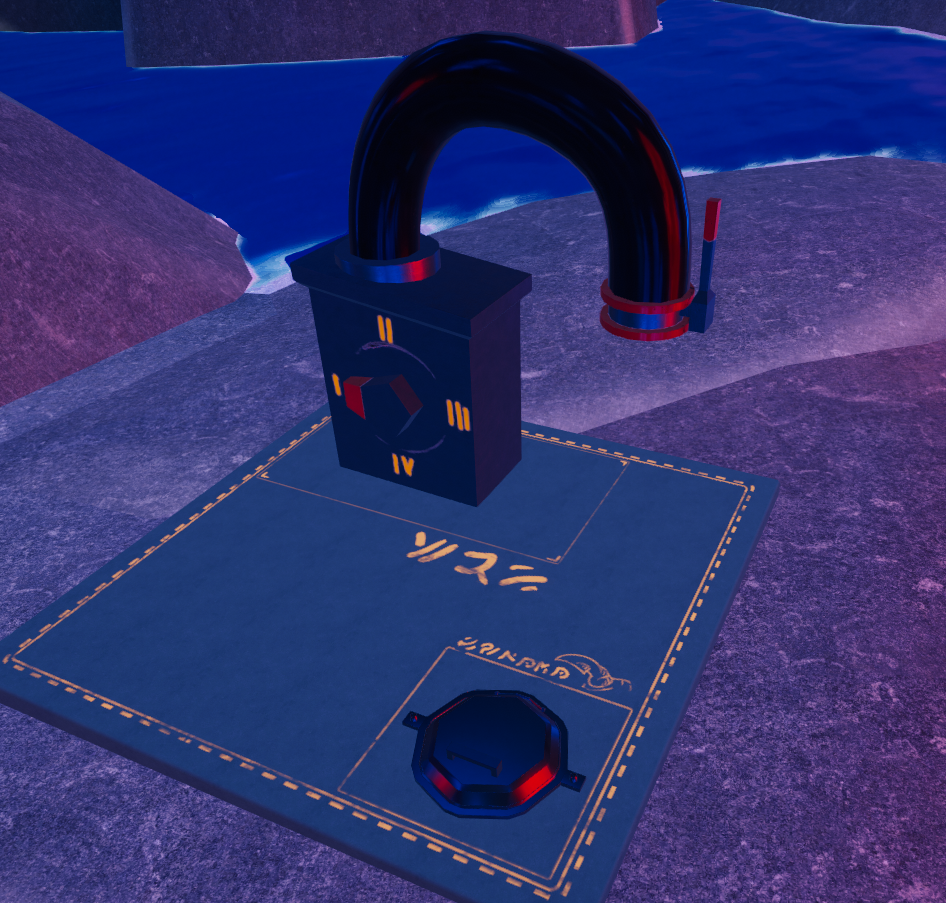

   

   Map1.0.PNG

This page will list all the **Locations** you can visit in KoboldKare.

# Getting Around

See [Movement](Movement) for details on Surfing and Bunny-Hopping, which can help speed your transition from location to location.

To assist with travel, there are Jump pads placed in strategic locations around the map. These propel the player and/or items towards a set destination. the jump pad can be bought for 80 dollars at the builder's shop, they are located at your farm and in town.

   

   Jump_pad.PNG

## House

The **House** is where you'll start the game.

   

   House2.PNG

**Inside you'll find:**

- *The Bed:*  
  Pressing "E" on the bed will allow you to gain energy. also works as a sex location.

   

   Bed.PNG

- *The Shower:*  
  Press "E" on the shower to turn on. Allows water refill as well as cleaning kobold.

    <!-- This is funny and immature, strechy shower -->

   Shower.PNG

- *The Toilet:*  
  Press "E" starts an animation and gets rid of your stomach contents.

   

   Toilet.PNG

And you can buy:

- *The Bathtub:*  
  similar to the shower but easier to use, works as a container that can store 100 unit, buying gives you an additional sex location.

   

   Bath.PNG

- *Blender:*  
  works like a grinder but faster, Sucks items nearby if they get too close.

   

   Blender2.PNG

- *Sex Animations*:  
  There are certain locations in the house with specific animations. See ***[Sex Animations](Sex)*** for more information

## The Farm

This is where you will spend most of your time, the farm has:

- *The Mailbox*:  
  this is where you will receive quests press E to collect them

   

   Mailbox.PNG

- *Farm Plots*:  
  This is where you can plant kobolds and plants, things planted here need to be watered twice by a bucket, once upon planting and a second time halfway through grow time.

   

   Farm2.PNG

- *Sqisher*:  
This extracts the stomach meter without wasting all the liquid inside like the toilet. Shaped like a wine presser.

   

   Press.PNG

There are additional [sex locations](Sex) in the yard

## The River

The lake is in the middle of the map. While Kobolds can neither swim nor drown, there is also fish that give meat when interacted with.

- *Inflator*:  
  There are 3 sections to the machine. When facing head on, the left is where you put a kobold you want to inflate. The button is for injecting stored liquid from the tank on the right. The tank can store 120 unit. On the right should be breeding mount (not included with the machine but included as breed mount upgrade from kitchen).
  - You can put any liquid in the tank by "throwing" liquid at it (and the breeding mount by extension).
  - The bellows can be held to increase the amount of liquid pumped when released, but it can't be specified; fully charge takes about 5 seconds.

   

   Inflator.PNG

## Huts 1&2

   

   Hutts.PNG

Hut 1 is for egg laying Hut 2 is a kitchen.

**Hut 1 contains:**

- *Egg Laying Station:*  
  drop a pregnant kobold next to it to begin laying an egg,  
  and one [sex location](Sex)

   

   Egg_layer.PNG

**Hut 2 contains:**

- *A Blender*: exactly like a grinder but faster

   

   Blender1.PNG

- *A Breast Milking Table*:  
  A kobold with breasts lays down on the table, and a second kobold must use the station to help milk them.  
  *\*Milk output is based on breast size. See [Alchemy](Items#Liquids) for more information on how to effect breast size.*

- *A Cum Milking Machine*: Used to assist with cum extraction from a kobold with a dick.  
  *\*Cum output is based on ball size. See [Alchemy](Items#Liquids "wikilink") for more information on how to effect ball and dick size.*

   

   Milkcum.PNG

## Town

Walk the path down the valley toward the giant buildings you'll arrive in the **Town**.

**Here, among other cosmetic buildings, you'll find:**

- *The Shop:* (*aka "Macromart", previously "Thicc N' Kwicc:"*)  
  Located on the farther left side of town, the Shop is where you can buy buckets, seeds, and kobold eggs

   

   Store.PNG

- *The Tool Store*:  
  They sell cosmetic items and useful things like regent scanners, watering cans, troughs, and ice.

   

   Store3.PNG

- *The Builder's Hut:*  
  the builders hut is where you buy machines for your farm

   

   Build.PNG

   

   Shop1.PNG

   

   Shop2.PNG

- *The Goblin's Crown:*  
  there is a plinko machine inside, where you can spend 25 dollars to get rewards.

   

   GoblinsCrown.PNG

   

   Plinko_macine.PNG

  

- *The Pawnshop:*  
  Previously a foreboding hole in the world, the pawnshop

- *Zany Ztuff*  
  has bombs, a dildo (not pictured below), and a scanner. You can find it between the two buildings as you hang a Left when first entering town. Items from the pawnshop cannot be refunded.

   

   Store_2.PNG

  

## Forests

   

   Forest.PNG

  

To the right of the town is the forest, witch leads directly into the cave.

Here you will find:

- *Eggplants, Pineapples, Melons, and Bananas*:  
  These fruits grow high among the trees and can be collected.
- *Mushroom Cluster*:  
  the mushroom is in the corner but more can be found in
- *The cave*

See [Items](Items) for more information on these fruits.

   

   Fruit.PNG

  

## Cave

With a little bit of exploring, you may find the cave at the back of the forest. in the cave you can easily find mushrooms.

   

   Cave2.PNG

  

Also in the cave you can find the tent with has a second shop that sells buildings

   

   Tent.PNG

  

   

   Shop3.PNG

  

**The shop sells**

- *Mind swap*:  
  this is at the farm in the back and it can swap your kobold with another one

   

   Mind_swap.PNG

  

- *Pipe*:  
  this machine can be toggled to spawn differing size kobolds and is placed directly outside the tent.

   

   Kobold_printer.PNG

  