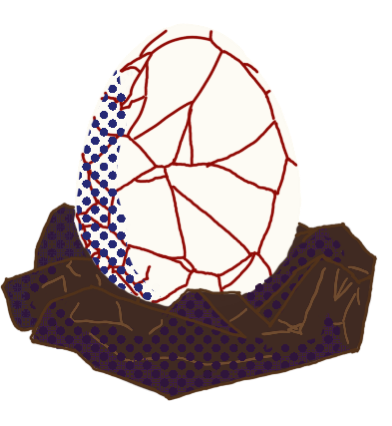
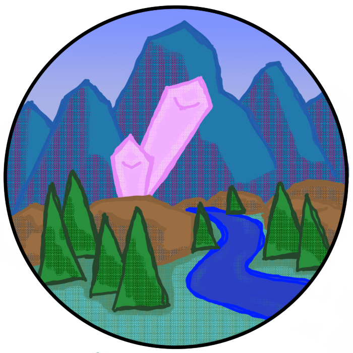
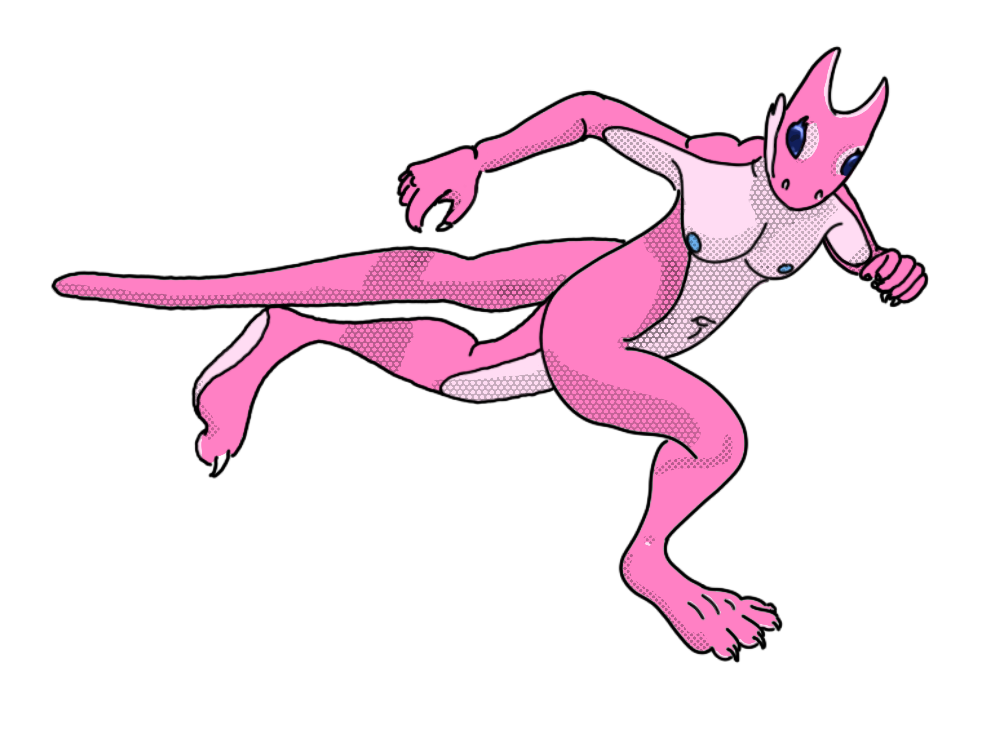
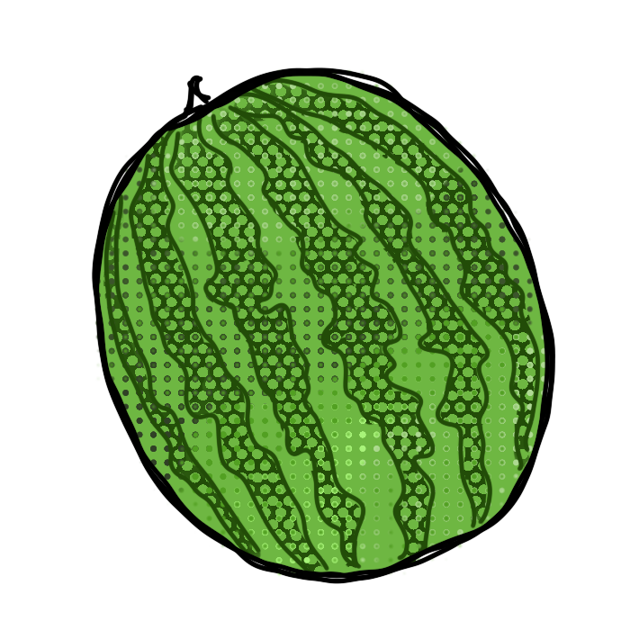
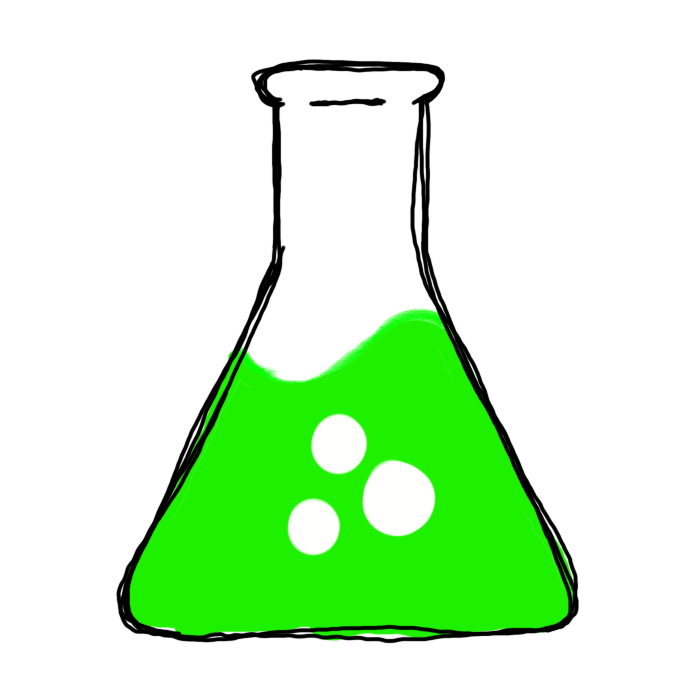

  

<table style="font-size:0.8em; text-align=center;">
  <colgroup>
    <col style="width: 12.5%" />
    <col style="width: 12.5%" />
    <col style="width: 12.5%" />
    <col style="width: 12.5%" />
    <col style="width: 12.5%" />
    <col style="width: 12.5%" />
    <col style="width: 12.5%" />
    <col style="width: 12.5%" />
  </colgroup>
<thead>
  <tr>
    <td>
      <a href="../done/Animations">
       
      
Getting started
</a>
    </td>
    <td>
      <a href="../done/Locations"> 
      
Locations
</a>
    </td>
    <td>
      <a href="../done/Farm_Upgrades" style="font-size:0.9em;" > 
      
Farm Upgrades
</a>
    </td>
    <td>
      <a href="../done/Movement"> 
      
Movement
</a>
    </td>
    <td>
      <a href="../done/Items"> 
      
Items
</a>
    </td>
    <td>
      <a href="../done/Items#liquids"> 
      
Alchemy
</a>
    </td>
    <td>
      <a href="../notdone/Equipment"> 
      
Equipment
</a>
    </td>
    <td>
      <a href="../notdone/Modding"> 
      
Modding
</a>
    </td>
  </tr>
</thead></table>

  KoboldKare is an Early-Access NSFW game developed by *Naelstrof* where the main activity is to raise cute Kobolds and sell them for profit to buy more Kobolds or tools.

<table>
  <tbody>
    <tr>
      <td>
        <h2 style="border-bottom:0; font-weight:bold;">
        
Information

        </h2>
      </td>
    </tr>
    <tr>
      <td class="plainlinks" data-valign="top" style="width:49%; background:#FFFF; padding:1.2em;">
        <h3 id="what_is_koboldkare">What is KoboldKare?</h3>
        
Imagine Harvest Moon but instead of just growing fruit you're growing naked Kobolds. KoboldKare is a fully fledged smut game with science and fantasy elements.

        <h3 id="where_can_i_get_it">Where can I get it?</h3>
        
Currently dev builds are available at the <a href="https://www.patreon.com/naelstrof">KoboldKare Patreon</a> under the 10$ tier.

        
You can also get it now on Steam for 14.99: <a href="https://store.steampowered.com/app/1102930/KoboldKare/">https://store.steampowered.com/app/1102930/KoboldKare/</a>

        
and itch.io for $15 USD: <a href="https://naelstrof.itch.io/koboldkare">https://naelstrof.itch.io/koboldkare</a>

        
<em>Note: Multiplayer functionality does not rely on Steam access, itch.io versions and Steam versions are cross-compatible</em>

        
The OST is also available on these platforms:

        
<a href="https://store.steampowered.com/app/1102930/KoboldKare/">Steam</a>
        <a href="https://1029chris.bandcamp.com/album/koboldkare-soundtrack">Bandcamp</a>
        <a href="https://open.spotify.com/album/5gsT6vlCldpeNBYmqGBZtL?si=_6RhxzM_RQmpcPkRm4ZaBg">Spotify</a>
        <a href="https://music.apple.com/us/album/koboldkare-original-soundtrack/1568717814">Apple Music</a> 
        <a href="https://music.youtube.com/playlist?list=OLAK5uy_k8HsCUWsZe4d6mmYAppfyBl2FEaPRvR_M">Youtube music</a>

      </td>
    </tr>
  </tbody>
</table>