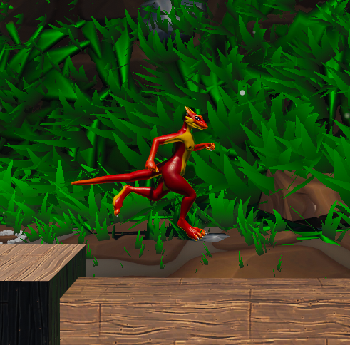

In KoboldKare, **Movement** isn't restricted to just moving on the ground at a snail's pace. Thanks to the physics system, which can be compared to quake or Valve games, you can strafe mid-air and gain huge momentum through repeated jumps. A speedometer was included to help me debug it, and it'll stick around for a short time.

It's also possible to slide on slanted walls and with some training, you can even launch into the skies this way. All of this is possible even when carrying 1 or 100+ items.

## Controls

(*Note: These can be edited in the configuration screen upon startup*)

   

| Action | Keyboard | Controller |
| --- | --- | --- |
| Movement | WASD | Left stick |
| Jump | SPACE | A |
| Use | E | X |
| Pick up | Hold LMB | LB |
| Throw/Activate | RMB | RB |
| Push/Pull Held Item | Scroll wheel | Left stick held&move |
| Crouch | L-CTRL | Left stick held |
| Suicide / Gib | Hold K | \[None\] |
| Walk | L-SHIFT | Dpad down |
| Inventory | TAB | Start |
| Ragdoll | Hold F | Y |
| Rotate | Hold R | Hold Dpad up and move right stick |
| Unfreeze | Q | Dpad down |
| Switch Camera | V | Dpad Down |
| First Person | 1 | \[None\] |
| Third Person | 2 | \[None\] |
| Freecam | 3 | \[None\] |
| Sticky Freecam | 4 | \[None\] |

### Camera Control

The camera now has a free-cam mode. Pressing C rotates through First Person, Third Person, Freecam, and Sticky Freecam.  The UI will be hidden on Freecam and Sticky Freecam.

| First person | Thirdperson | Free camera | Sticky Freecam |
| --- | --- | --- | --- |
|  |  |  |  |

By default these are also assigned to the keys 1,2,3, and 4 respectively.

This is particularly useful with **[Sex Animations](Sex_Animations)**

## Source Movement

In games that use the source engine (or uses code to emulate the style of movement like KoboldKare), players have found techniques to build speed and travel faster. The techniques listed will also work in other games.

#### Bunny-hopping
Running and holding *Jump* will cause your character to do **Bunny-hops**, or **Bhops** for short. Turning in the air, as well as increasing your speed is done by performing **strafes**.

Strafing is horizontal movement by using the A and D keys, or the Right Stick on controller. To turn while in the air you need to slowly drag your camera (Mouse, Left Stick) to either side and press the corresponding strafe key. To turn left in the air, hold A or push Right Stick to the left and turn your camera left, and mirror these inputs to turn right. Note that you should never hold W while in the air, as this will mess up your movement.

#### Surfing

**Surfing** is performed by strafing against an angled wall and is an effective tool to gain speed, as well as vertical height. Simply hold your Strafe keys (A and D, or Right Stick) against a wall to slide on it. To surf on a wall on your right hold the D key, and if the wall is on your left press the A key. Look towards the wall to ascend it, and away to descend it. Any wall between 90° and 45° will work, but at higher speeds you may slide on angled ground.

#### Different styles

Strafing with different keys will grant you different results. Mostly used for style points, or as categories in dedicated game modes.

| Style | Keys | Notes |
| ---- | ---- | ---- |
| Normal | A, D |  |
| Sideways | W, S | Locks your camera looking to one side instead of forward. |
| Backwards | A, D | Initiate by running or turning backwards. |
| Half-Sideways (style 1) | W+A, S+D *or* W+D, S+A | Makes you look diagonally. |
| Half-Sideways (style 2) | W+A, W+D | Flick 45° to catch up with your direction of movement when alternating direction. |
| Backwards Half-Sideways | W+A, S+D *or* W+D, S+A | You can't be serious. |

> [!NOTE] Developer Note  
> *"The Developer hates you and so do I"*  
> * Firgof 4/1/2021

## Flight

Because of the physics engine, there are several unofficial methods of flight available as well.

| Flight method | Ease of use | Method | Pros | Cons |
|---|---|---|---|---|
| Foot | Simple | Ragdoll, then grab your foot.  Apply force like the dick.  | Easy to control, fine control can be learned.  | You do not come right out of a ragdoll while flying, which can beperilous.  |
| Partners | Technically, Simple | You and at least one other person grab each other. | Two people with a bond of trust can special grab and fly withextreme precision. The easiest method to take to the skys | The easiest method to chaotic spaghettification and death. Generic grabs from one or both parties are difficult to control/get offthe ground. Special grabs only work well when one person steers. |
| Box | Medium | Special grab a box or another flat\-ish object. Place it beneath you. Jump. The special grab keeps it the same distance away from you for youto continue jumping. | You can force yourself very high by pulling the object intoyourself. | Need an object. Learning curve to moving any direction but up and down. |
| Newton's 3rd law | Medium | Special grab an object. Push it away from you a little. Look down and jump.  The object should be below you keeping you suspendedin the air. You can 'push the object' farther to raise you higher.  | Fun, kinda feels like a pogo\-stick. The force applied is invisible to others. Freezing the object allows for very fine positioning of yourkobold.  | Need an object, and this method leave it vulnerable for beingmistook as a free object on a multiplayer server. There is a maximum distance before it gives out under you. Moving forward is more of a chore than it may be worth.  |
| Egg | Hard | Put an egg inside you | Good prank | Difficult if not impossible to have sustained flight onpurpose. |
