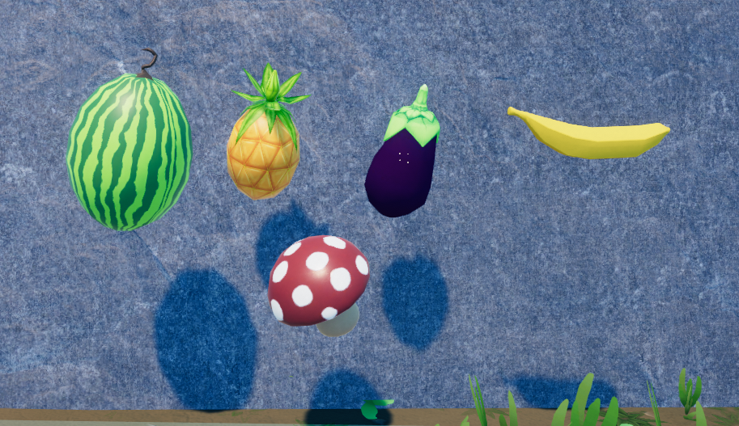
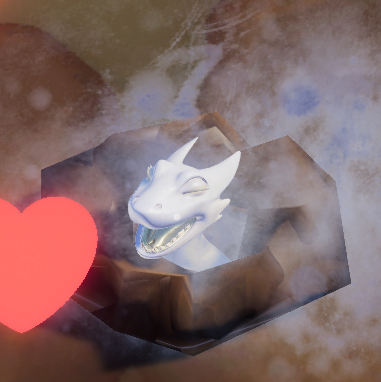
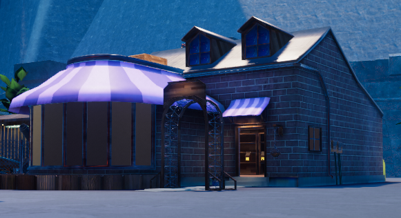
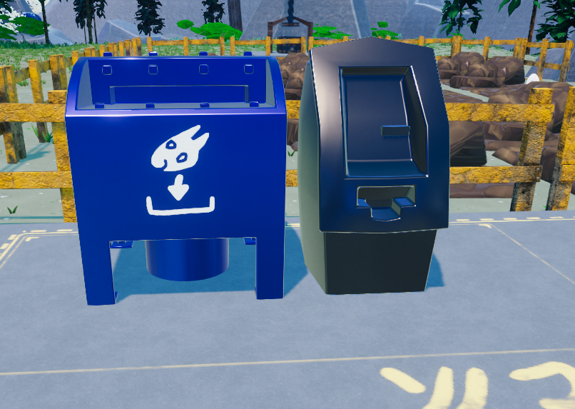
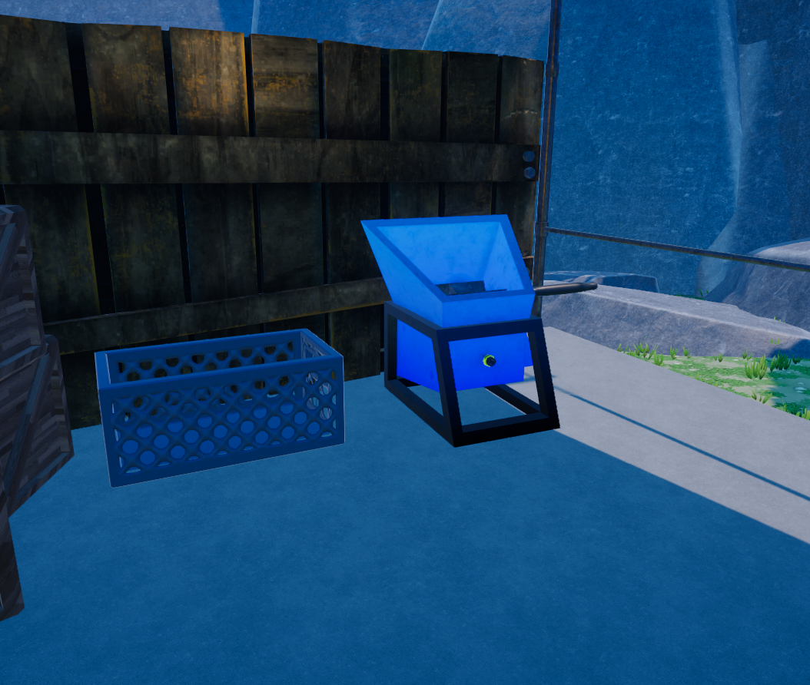
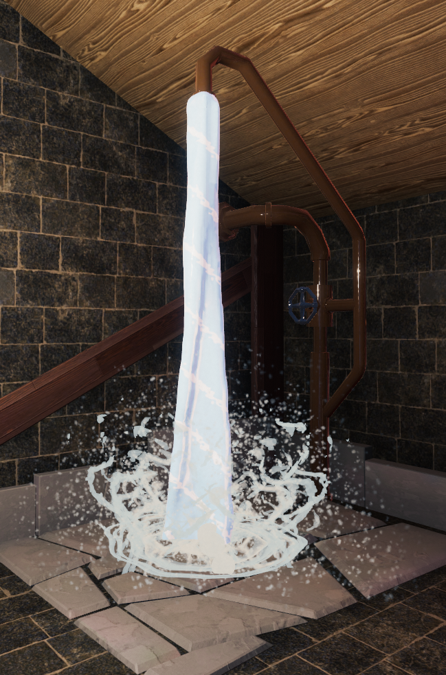

This **Quickstart** guide will walk you through your first steps of KoboldKare, and help you on your way to becoming a seasoned Kobold Farmer!

## Goals

Currently, the only goal in KoboldKare is to complete all 30 objectives. These objectives can be found at the mailbox directly in front of your house. In order to fully complete the game, you will follow this basic game loop:

- take quests from the mailbox
- Hatch your Kobolds from their eggs
- Collect resources to "upgrade" your Kobolds
- Sell Kobolds and/or items for money
- Buy more eggs and equipment from "Macromart", previously "Thicc N' Kwicc"

Rinse and repeat!

## Basic Walkthrough

What follows will be a sort of "tutorial" for your first three in-game
days for a SINGLE PLAYER session. It will cover all of the basic
concepts of the game that you can follow along with.

Before you start a session, feel free to [Customize your Kobold](Customization)

When you first start your game, you will be placed inside your house, inside the bedroom. On your HUD you will notice your **Money** in the bottom left, along with F for **ragdoll**, shift for **grab**, C for **cycle camera**, R for **rotate hips**. Additionally *Tab*. On the top left is energy, stomach capacity, and digestion. On the bottom right is your stars, witch you get from doing challenges. Tab is used to pull up a inventory witch is currently only useful for unequipping worn items. when you spawn you will want to press click on the front doors of the house this will let you out.

The bedroom is to increase your energy meter. To the of spawn, you'll see both the **main hallway** and directly in front of you the **Master Bathroom**. The Shower can be used to clean yourself and other Kobolds as needed and fill up buckets and watering cans. Out the bedroom, take a left down to the entryway.

If you walk outside, you find a mailbox wit a large beacon on it. You will notice the garden area is rocky terrain. We will clear these out later.

For now, click on the mailbox to get the **Kobold egg** press E to pick it up, then go to the empty brown tiles in the yard and press e while holding the egg, hold the **bucket** with *Left-Click* (LMB), and spray water on the egg with *Right-Click*. Once hearts appear over it, you'll know the egg is sufficiently watered.

There are *two* ways you can hold items:

- *Shift + Left Mouse Button*: This will physically grab the item from the point where the hand cursor appears over them. It's useful for more finely manipulating an object's position, or posing kobolds.

- *Left Mouse Button*: Holding an object this way will bring it close to you. You will be able to move quickly and use interactive items. (such as sprayers) in this state press F or Right mouse to interact.

This is a good time to note that you can **throw** items by holding them with LMB, and then pressing RMB. However, you can't throw sprayers, as this just sprays their liquid. Try tossing multiple items to speed up collecting by getting multiple things where you need them at the same time!

After your Kobolds are planted and watered, your bucket will be low on water. Refill it by submerging it in the shower, river, fountain, or bathtub.

Now it's time to have some fun with your Kobolds. First, bring out the Kobolds cramped behind the table. Now we can experiment with **liquids** and **sex**.

- Spraying Kobolds with different liquids will have a variety of effects. You can mix liquids for even more effects. (See [Items#Liquids](Items#Liquids) for a full list)

- If a Kobold without a penis has sex, or if you use a dildo on them, they will produce **Hearts**, which can be ground up for use in liquids. Ones with dicks can also produce cum, which will metabolize into eggs.

Try spraying down one or both of the Kobolds with the melon juice. This will cause their breasts to expand. You can only spray one Kobold at a time, however. Once their breasts are sufficiently plumped, grab either the dildo or a Kobold with the penis (using LMB) and drag it/them to the other Kobold. They will bend over once it's near, allowing you to dynamically penetrate them. Alternatively, you could attempt a [Sex Animation](Movement). Eventually, a heart will pop out. Once you're finished playing with your Kobolds, make sure to bring your kobolds inside where they are safe from the night monsters. There's not much more you can do today, so you can head to bed. As long as all your kobolds are inside, there's no penalty for turning in early. Press *E* on the bed to sleep and skip to the next day.

Now that you're well-rested, it's time to get started with chores. Outside, you'll see that Your Kobolds have sprouted, and their heads are sticking out of the dirt. Give them some more water and refill the sprayer. Now we're going to pick some **melons** and **Eggplants**. Travel down the path and take a right.

Now we can talk about [Movement](Movement). Jumping while you walk will increase your momentum, especially uphill. This will let you get around a lot more quickly. Be careful hitting sharp angles, though! This can slow you down, or send you in a different direction completely. Try jumping, turning, and strafing mid-air to get a feel for the movement system. Movement is fun in its own way!

If you look around the forest, you'll find some melons hovering and glowing green and some eggplants, glowing purple. Grab one with LMB and bring it back to the kitchen for safekeeping. Then you can either go back to the forest and find more (there's typically three to five per day), or continue down the road to the **store**.

If you go into town, in the store with the purple roof, you'll find all sorts of wares sold by the goat shop-keep, named Gruff. For now, we're just interested in another Kobold egg. Press E on the egg and bring it back to the farm. Plant, water, and refill. Then you can either have some more fun with your Kobolds or go to bed.

Heading outside, you'll find your two Kobolds fully grown and standing around. Water the one you planted and bring one of them inside. For the one leftover, toss them into the blue mailbox on your left. This will sell the Kobold, and you'll see your money go up on the bottom left. With this money, you can unlock the **Grinder**. Simply walk up to it and press the large white button on the front. Now that this is active, we can grind up just about any item to make various liquids (Yes, even Kobolds). For demonstration purposes, we will make a **Growth Potion**. Gather these items in front of the grinder:

- Two hearts
- One melon
- One eggplant
- And empty trough

Put the hearts, eggplant, and melon at the top and press the red button on the side. Then while it grinds, place the trough in front of the hole on the front of the grinder to catch the liquid. You can then turn the grinder back off. The trough should be filled with a green substance. Now find a Kobold spray them down. They will grow to be much larger.

One last thing, the garden is probably still covered in rocks. You can purchase bombs at the [Pawnshop](Locations#town) in town to use to clear the garden for more area to plant Kobolds.

And that's the basics covered. From here you should be well equipped to explore the rest of the game. Have fun!

## Tips and Tricks

- You cannot grow a penis on a Kobold that does not already have one
- Again you can only [Customize your Kobold](Locations) before a session
- Don't worry about growing a Kobold too large. The can have vanilla sex at any size.
- Any particular Kobold asset can only be 10x the starting value.
- See **[Sex](Sex)** on how to start a sex animation

## Key locations

*See also [Locations](Locations)*

**Selling mailbox:** Throw in Kobolds or other objects to sell them for money.

**Shower:** Here you can fill sprayers or flasks with water to grow Kobolds. You can find it to the right when you exit the house.

**Grinder:** To use this you first have to unlock it with 50 bucks. Once unlocked, you can turn it on or off with the crank on the side. Now you can throw in whatever you want into the top and grind it down into various [Liquids](Items#Liquids). The grinder doesn't store anything, so make sure to catch whatever comes out with a sprayer or directly with a Kobold or trough.

See [Locations](Locations) for more information, including the Cave and how to get around.

|  |  |  |
| :-: | :-: | :-: |

Sell.PNG\|Selling Pit Grinder.PNG\|Grinder Shower.PNG\|Fountain

