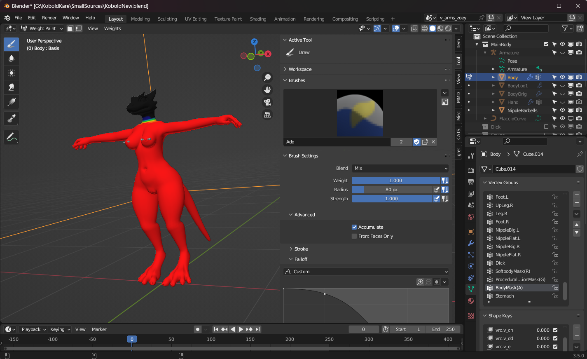

The game by default puts the camera between the eyes specified within the Rig Configuration of your model.

    
   HeadVisible.png

Parts inside of the head can be visible from the first person camera, to prevent this we need the following to be set up:

1.  The Vertex Color of the head needs to have 0 alpha.
2.  The head needs to be using the Kobold shader.
3.  Finally, the Renderer needs to be specified in the Character Descriptor.

## Setting the Vertex Color of the head to zero

Blender by default doesn't support setting alpha Vertex Colors, though with the addon [Vertex Color Master](https://github.com/andyp123/blender_vertex_color_master) we can set it.

First we need a vertex group that has 1 weight for the body, and 0 weight for the head. This is what will tell the game to make the head invisible.

    
   Kobold_bodyMask.png

Then we can use [Vertex Color Master](https://github.com/andyp123/blender_vertex_color_master) to transfer the vertex group into the alpha of the vertex colors using this menu in Vertex Paint mode.

    
   BodyMaskTransferToAlpha.png

## Ensure the material is using a Kobold shader

This is easy, just make sure the renderer that contains the head is using a Kobold shader, you can select it and use the drop down to change shaders. This might already be set up proper.

    
   KoboldMaterial.png

If the material doesn't let you change shaders, then make a new material in the project tab, set it to use the Kobold shader, then drag and drop it on your character's head.

## Specify the renderer in the Character Descriptor

It may already by specified here, but it's required for the game to detect it as something that needs the alpha to be read for visibility.

    
   KoboldBodyRendererSpecified.png

