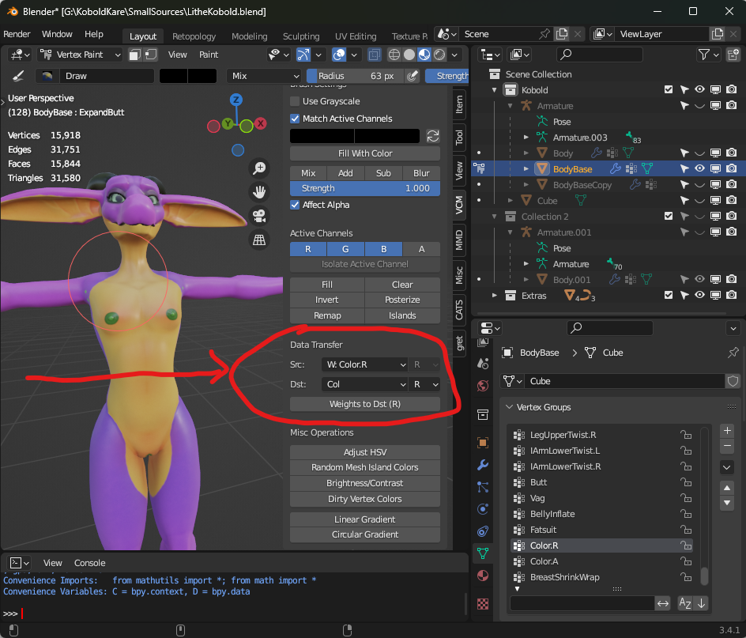

This article assumes you have finished both [Installing the KoboldKare SDK](../done/Installing_the_KoboldKare_SDK) and [Getting started with Character Modding](../done/Getting_started_with_Character_Modding).

With your character working in game, now you want to add some jiggle to the character!

There's a couple of interlocking and communicating parts to JigglePhysics, namely the inflation systems and the ragdoll systems need to know about some various configurations. I'll cover what I can here.

## Jiggle Skin

Jiggle skin is a sort of a hack to allow for some extra tertiary movement without adding extra bones. It's not trivial to set up, but can add some really pleasant skin motion to a character. It jiggles fatty areas.

### Prerequisites

First we need to vertex color the parts that we want to jiggle, unfortunately vertex colors are in the per-vertex domain, we need it to be in the per-Face-Corner domain. I use [Vertex Color Master](https://github.com/andyp123/blender_vertex_color_master) to convert a Vertex Group to a color to accomplish this.

Create a vertex group with the parts you want to jiggle painted with a weight. The stronger the color the more intense the movement, you'll want to make the weights super soft with the blur tool, otherwise they'll be really sharp, pin-like jiggles.

    
   Lilith_jiggle_vertex_group.png

With the vertex group created, you can use the [Vertex Color Master](https://github.com/andyp123/blender_vertex_color_master) addon to convert the vertex group to the Red color channel of the vertices.

    
   Lilith_vertex_group_transfer_to_red_color.png

This keeps the vertex colors in the Face-Corner domain, which prevents vertices sharing a face from having different vertex colors.

Finally, in your prefab, ensure that your model is using a Kobold shader for the skin material, it's one of the few shaders in the game that includes the JiggleSkin components necessary.

### Setting up Jiggle Skin

1. Add a Jiggle Skin component to the root of your character.
2. Create empty game objects at the center of where you want jiggle to happen. For Lilith that'll be on the breasts and belly. For other characters you may want to add some to the butt too.
3. Add jiggle zones for each object you created, within the Jiggle Skin. 
4. Set the jiggle settings to one of the existing Soft blends.

    
   Lilith_jiggle_skin.png

## Jiggle Rigs

Jiggle rigs are purely bone-based jiggles, allowing you to jiggle breasts, tails, hair, ears, and anything else that is boned and floppy.

### Prerequisites

First we need a JiggleRigBuilder component added to the root of the character. This will drive all of the immutable jiggle objects on your character.

Simply add a new JiggleRigBuilder to the root of the prefab, next to the CharacterDescriptor like so:

    
   Add_jiggle_rig_builder.png

### Setting up breast jiggle

The game assumes that breasts will go from completely flat to fairly large.

Simply add two new Jiggle Rigs by hitting the + button in the JiggleRigBuilder, and set their transform to be the root of each breast bone.

Then make sure that the JiggleSettings have some sort of BreastBlend configuration. You can create a custom configuration if desired, though the default BreastBlend JiggleSettings should work great for most circumstances.

    
   Breast_jiggle_lilith.png

### Setting up tail jiggle

Tails are special in KoboldKare because players can grab characters by them, so they need to be capable of disabling and enabling jiggle at any moment.

To deal with this, we're going to create a special JiggleRigBuilder on the Hip bone.

    
   Tail_jiggle_setup.png

The JiggleSettings can be set to whatever you want, though Tail has okay settings for various kinds of tails.

Finally, we need to let the ragdoller know that it should disable this rig when it ragdolls. So that the physics simulation can take over.

You can do so by dragging and dropping the Hips into the "Disable Rigs" portion of the Ragdoller.

    
   Tail_setup_ragdoller.png

### Setting up various jiggle

For things like big floppy ears, hair, loose clothing. You'll want to add a unique Jiggle Rig for each by hitting the + button within the JiggleRigBuilder.

Then setting each to a JiggleSettings. Not all jiggly things jiggle with the same settings though.

#### Creating a custom JiggleSettings

Find a jiggle setting within your Project Tab that you think will jiggle similarly to what you're wanting. For example floppy ears might jiggle in a similar manner to hair. You can find all jiggle settings in the project by searching `t:JiggleSettings` in the Project Tab search bar.

Then hit Ctrl+D to duplicate the setting, name it what you want and tweak it freely.

You can also create a new JiggleSetting via the create menu by right-clicking in a folder within the Project Tab and hitting  
Create → JigglePhysics → Settings.

