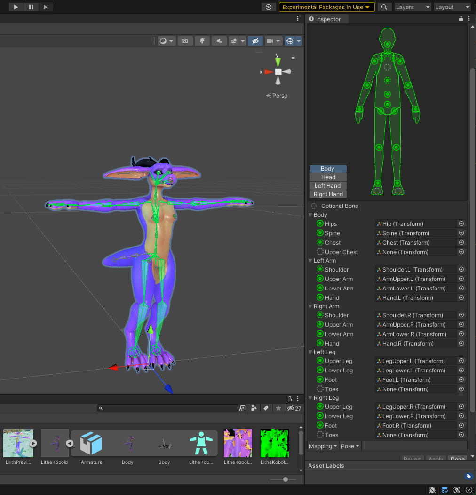
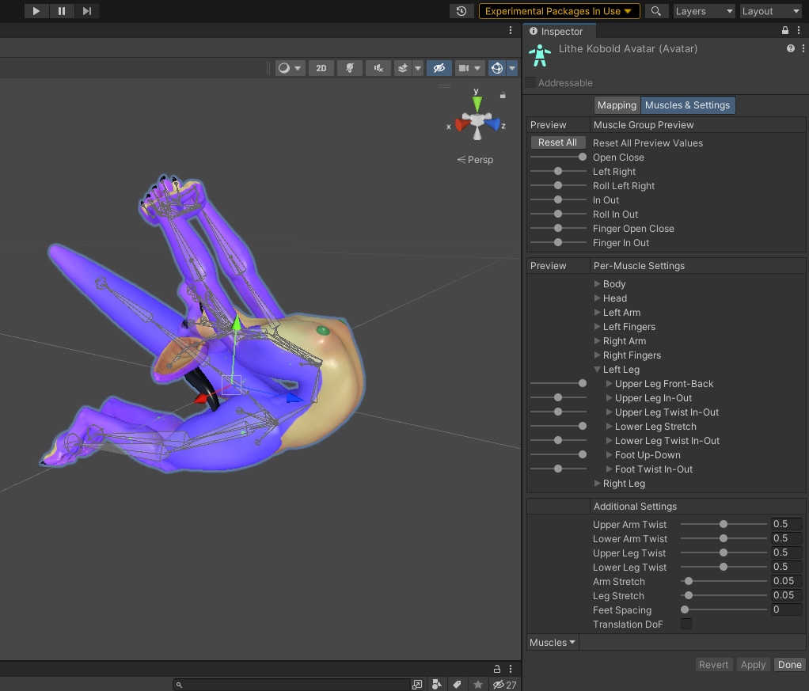
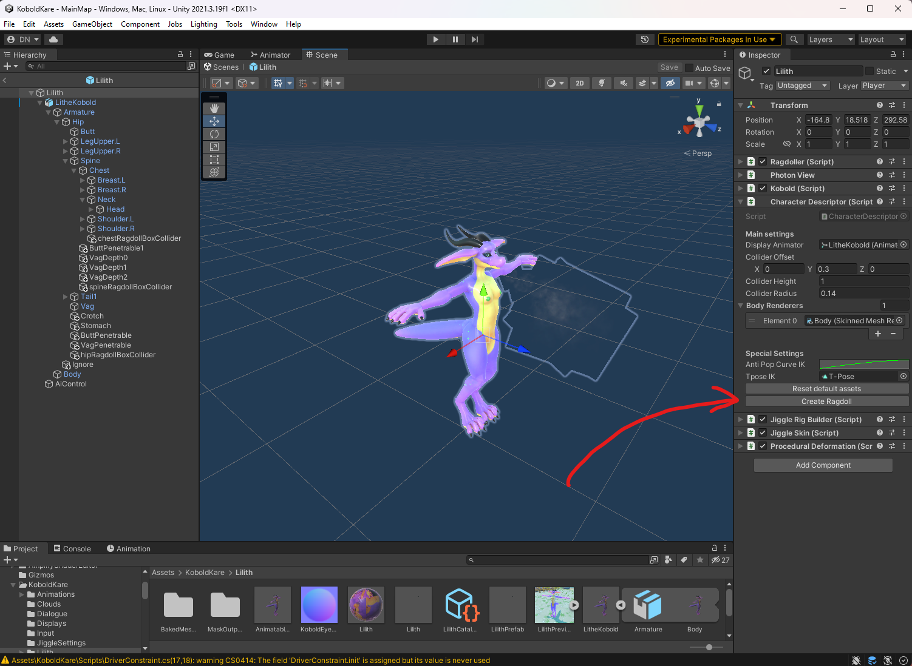
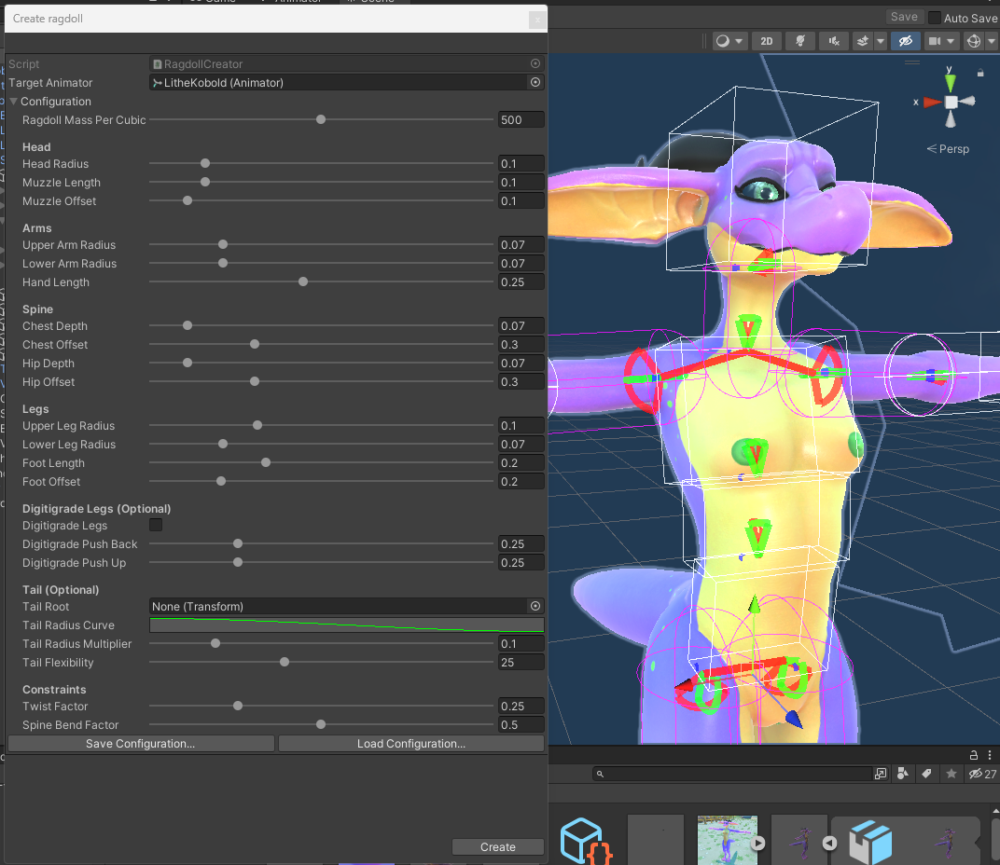

Ultimately your model just needs to have rigidbodies connected by ConfigurableJoints, with each body specified in the Ragdoller. Luckily we can use the Ragdoll Creator to automatically create a pretty decent ragdoll for us and configure the Ragdollerautomatically.

##  Ragdoll Creator prerequisites

To use the Ragdoll Creator, we need to make sure that our model is humanoid, has an animator, and has all the required humanoid body bones within the Rig Configuration.

    
   Lilith_rig_config.png

The Ragdoll Creator reads these bones to generate the ragdoll.

We also want to configure the Muscle Limits within the Rig Configuration, the Ragdoll Creator reads these limits to generate the configurable joints.

    
   Lilith_muscle_limits.png

It's a good idea to edit the lower leg limits if you have digitigrade legs to prevent clipping.

##  Using the Ragdoll Creator

Simply click on Create Ragdoll in the Character Descriptor of your prefab.

    
   Ragdoll_creator_location.png

A wizard should appear. Fill out the information to the best of your ability. Then Save the configuration, if you end up realizing something needs to be different, you'll be able to Load the configuration so you don't lose what you had.

Magenta collider previews are to show you joints that will be no-collided to prevent the ragdoll from self-colliding infinitely. It's best if none of them are magenta as it prevents accurate ragdoll simulation, though it might be unavoidable in some cases.

    
   Ragdoll_with_colliding_child_joints.png

