KoboldKare has many alterations that affect player characters, while you don't need to create any to play right away, the game is much more fun when characters have the inflation features listed below.

The blendshape names don't need to match, as you specify them manually in-game while setting up your character.

## How Inflaters work

On the Kobold component (and in various other places), there's a set of Inflaters. For example the Belly inflater, Fatness inflater, Boobs inflater, and the Size inflater to name a few.

These are essentially tween handlers that make sure that things inflate in a pleasing manner (with a fun bouncy curve). What's cool about them is that they don't care what they send the tween data to, so you can have a character react in any manner to the incoming inflation data.

Using built-in inflatable listeners, you can have a model respond in many ways-- most inflations will be driven by blendshapes, but in some cases you may want to adjust jiggle settings, bone rotations, transforms, or drive Animation parameters.

You may add as many inflatable listeners as you want to an Inflater, it uses SerializeReference to embed listeners into the prefab. The rest of this page will be used to describe some basic inflater configurations for characters.

## Blockout technique to create drastically different Blendshapes

I do have a trick for creating radically different blendshapes, taught to me by my friend [Eugene](https://www.furaffinity.net/user/ewwgin) first start with creating a cube.

   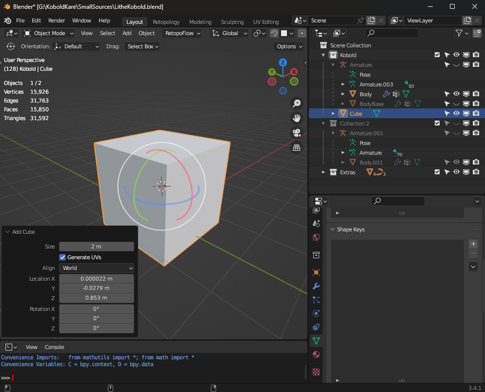 
   Create_Cube.png

Then delete all but one edge, add an edge loop so that you have three verts in a line.

   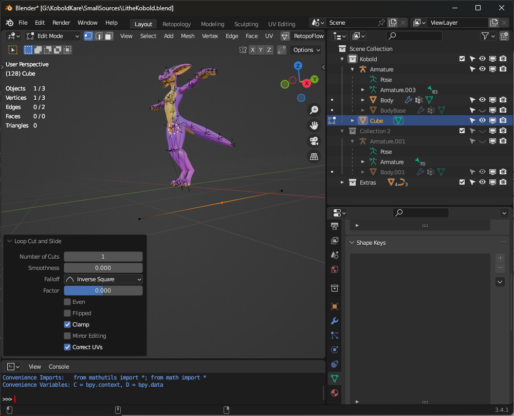 
   Single_edge_with_3_verts.png

Then I convert it to a Curve, increase the bevel depth, and set the resolution to 0.

   <a href="../images/setting-up-inflation-features/Blender_KABRXk6Zle.mp4">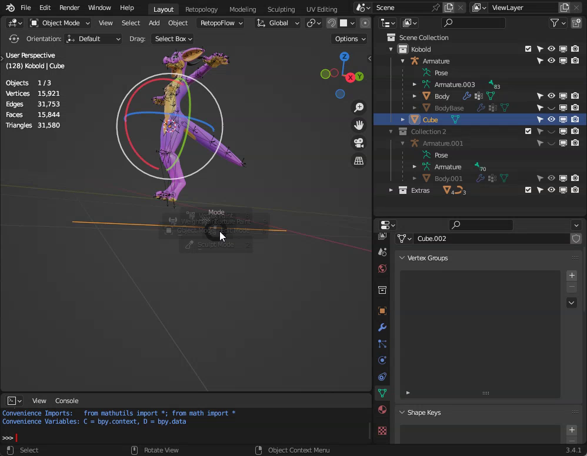 
   Click to watch the video</a>

Then I pinch off the ends with the Curve Radius tool, add a Mirror Modifier, Weld Modifier, and a Subdivision Modifier

   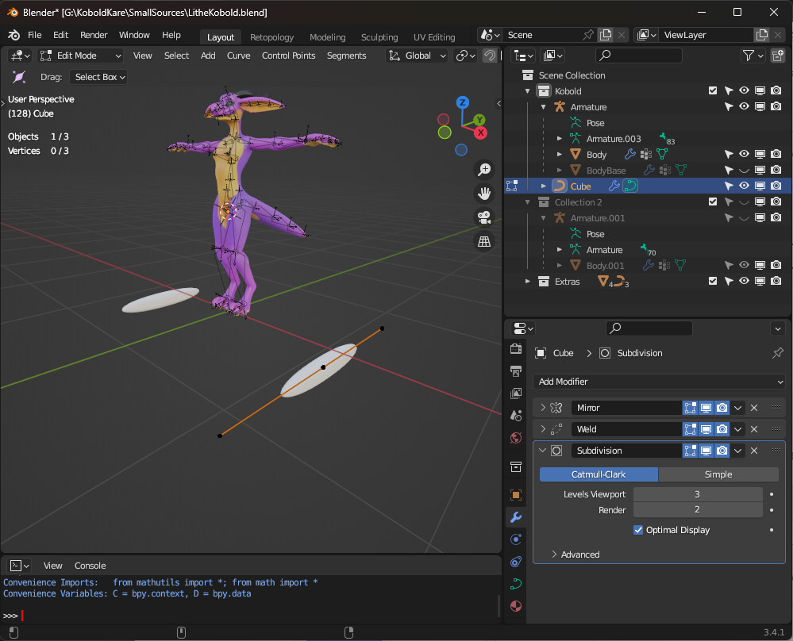 
   CurveBlob.png

Now this curve can be used to block out various organic shapes, like a breast, or a fat suit, muscles, or whatever else.

   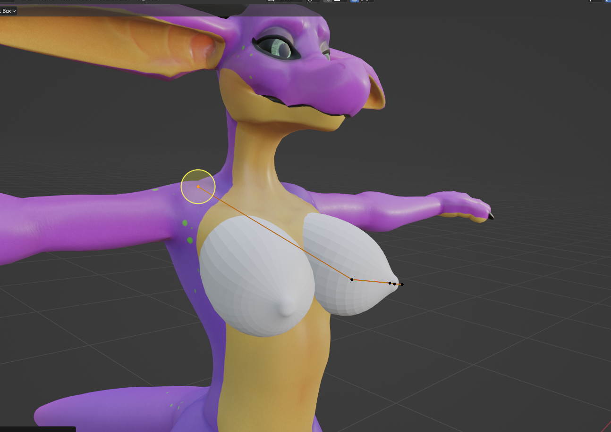 
   Lilith_bigger_breast_blockout.png

Simply by moving the verts around, adjusting their radius, and subdividing when you need more control points, you can very quickly block out the new shapes that the character will exhibit.

### Using the blockout to generate the shape key

Now that you have the shape that you want the character to have. I like to use the shrinkwrap modifier to give me a starting point.

First, create a vertex group that represents what areas you wish to be shrink-wrapped.

   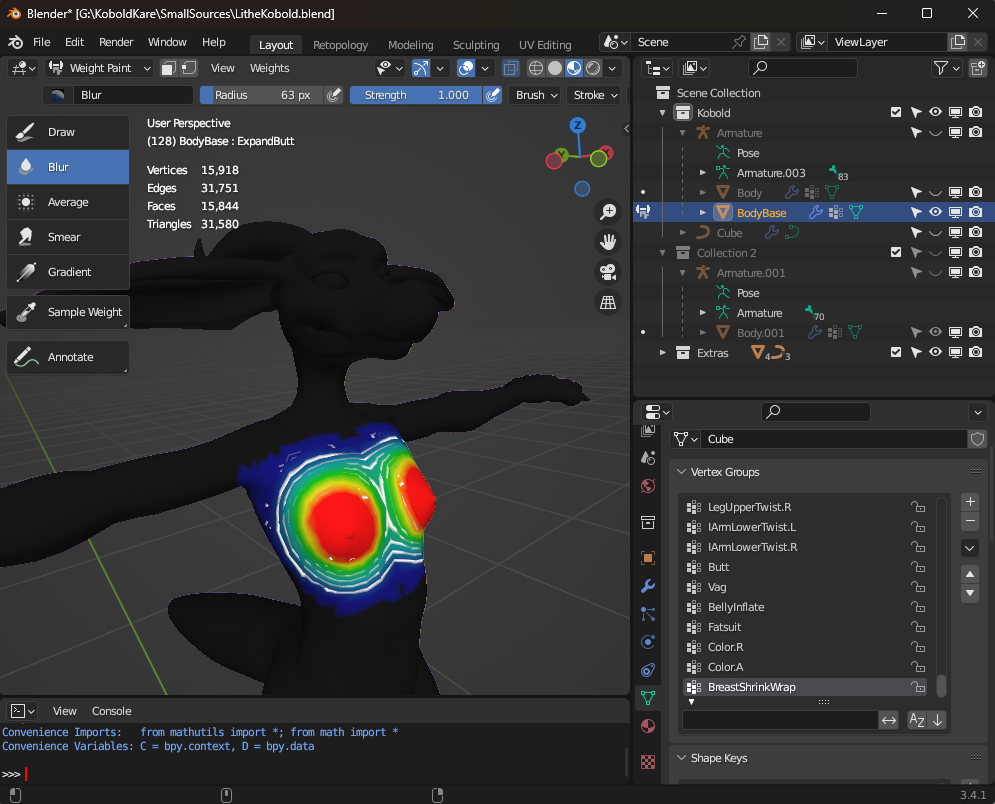 
   Lilith_breast_shrinkwrap_weights.png

Second, we need to make sure our blockout is manifold, with only one inside, and one outside. The easiest way to do this is to add a Remesh modifier and set the voxel size low.

   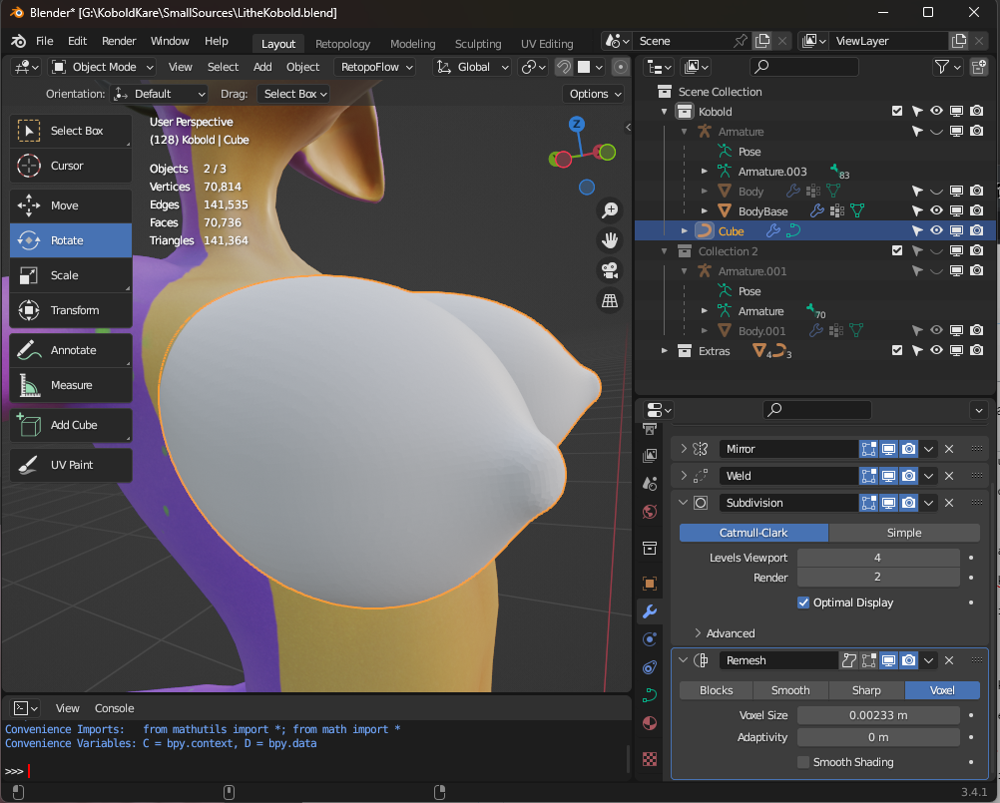 
   Lilith_remeshed_breast_blockout.png

Third, we want to work on a duplicate of the original model, this is so we can repeatedly apply the shrink wrap modifier as we get it closer to the final shape. You'll need to delete all shape-keys on the duplicate so we can apply the shrink wrap modifier.

   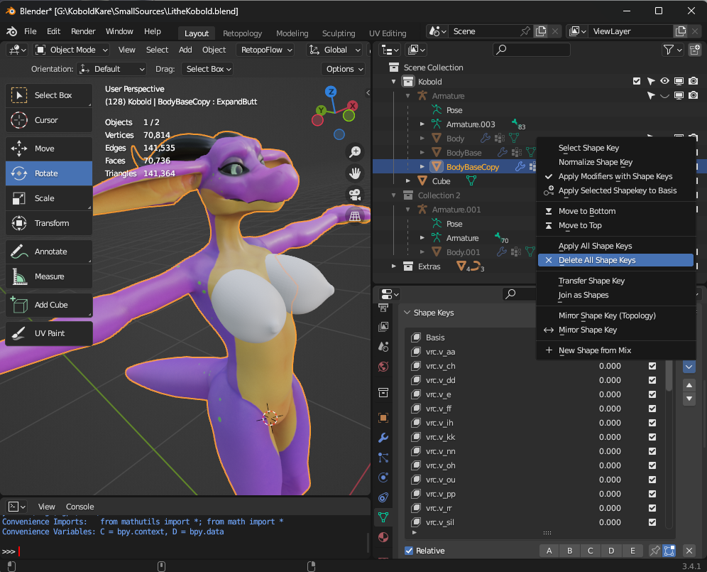 
   Lilith_copy_blendshape_delete.png

Finally, we can add a shrinkwrap modifier to the model, using the vertex group we created earlier as a filter, with our remeshed blockout as the target. The shrink wrap won't let us target the curve, so we'll have to quickly convert the blockout to a mesh. You should back up the curve before you do this though just in case you want to adjust it later.

   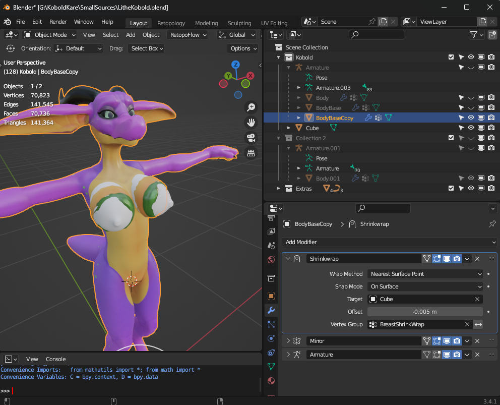 
   Lilith_shrinkwrap_start.png

From here our goal is to adjust the vertices until they rest properly on the blockout we made. I like to start by proportional editing the breasts out to match.

   <a href="../images/setting-up-inflation-features/Blender_Dt35q6t7CP.mp4">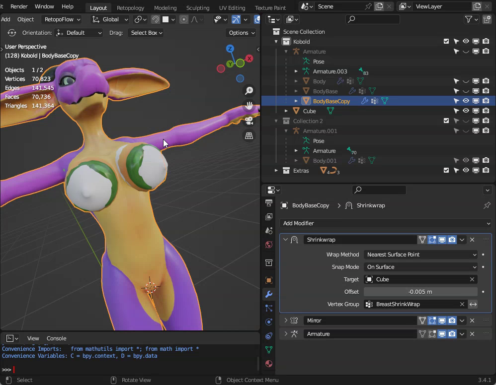 
   Click to watch the video</a>

Each time we make a large adjustment, we can duplicate and apply the shrinkwrap modifier in order to update the true underlying shape of the vertices. With the true underlying shape, we can use the Slide Relax tool to slide the vertices around on the surface of the blockout to make them line up nicely, and to evenly distribute the polygons. Holding shift with the Slide Relax tool "smooths" things, otherwise it slides verts around.

   <a href="../images/setting-up-inflation-features/Blender_YaVeAuOIRx.mp4">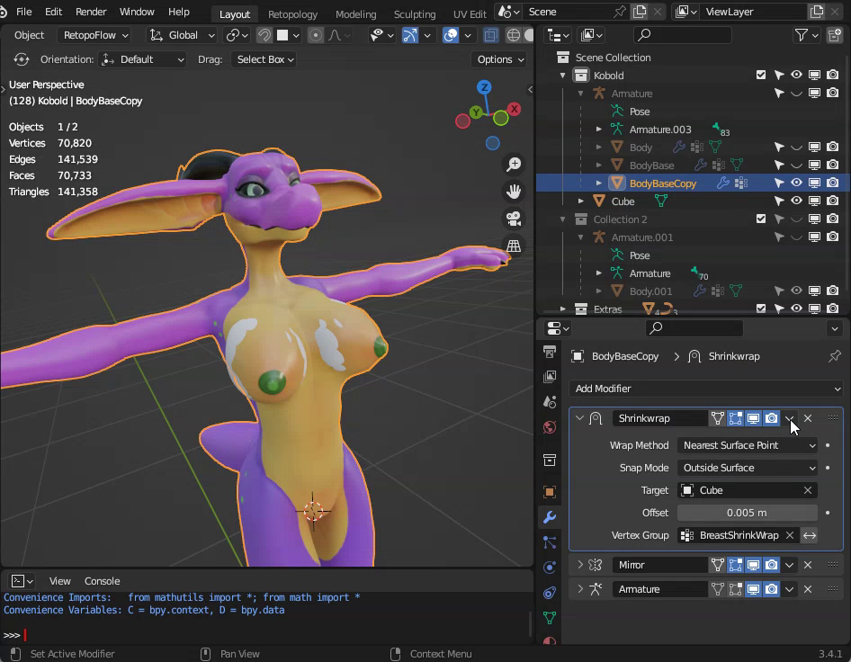 
   Click to watch the video</a>

Anytime the slide relax tool seems to be working funny, you may need to re-apply the shrink wrap to update the underlying vert positions.

When you're done adjusting the shape and making it look really nice, you can select it, then your original mesh, and use the Join as Shapes option under the Shape Keys data sub menu.

   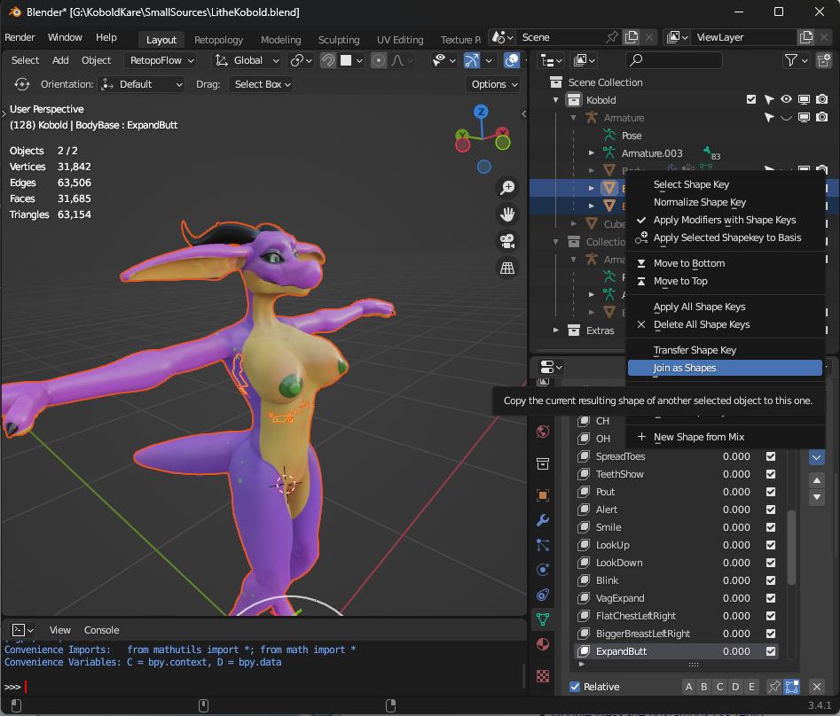 
   Lilith_join_as_shapes.png

## Breast Inflater

Breasts in KoboldKare are the primary way to distinguish gender, and go from flat-chested to infinitely large. The current available Breast Inflators assume that the default shape is with regular sized feminine breasts, with a shape to make them flat, another shape to make them large, and a bone to inflate them further.

### FlatChest shapes

Takes the character from neutral to flat-chested, one per breast. I have no special tricks with this one, I just use proportional editing and the edge-slide relax tool to flatten the chest and make it look as natural as I can.

   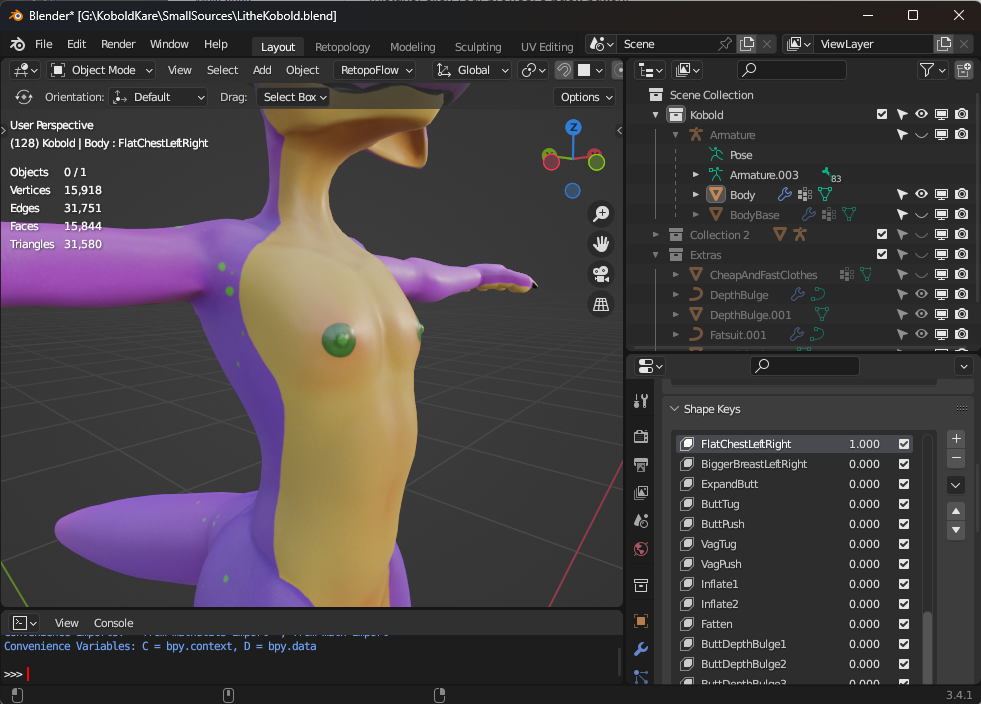 
   Lilith_FlatChestLeftRight.png

If you have a perfectly symmetrical model, you can end the shape name with "LeftRight", which will split it into two shapes upon import into Unity. If your model is not perfectly symmetrical, you'll need to make a unique shape for each breast.

### BiggerBreast shapes

Takes the character from neutral to large-breasted, one per breast. It's best that this shape prepares the breast to be scaled by a bone that it's weighted to, since this shape is fully triggered before it begins scaling the bone.

   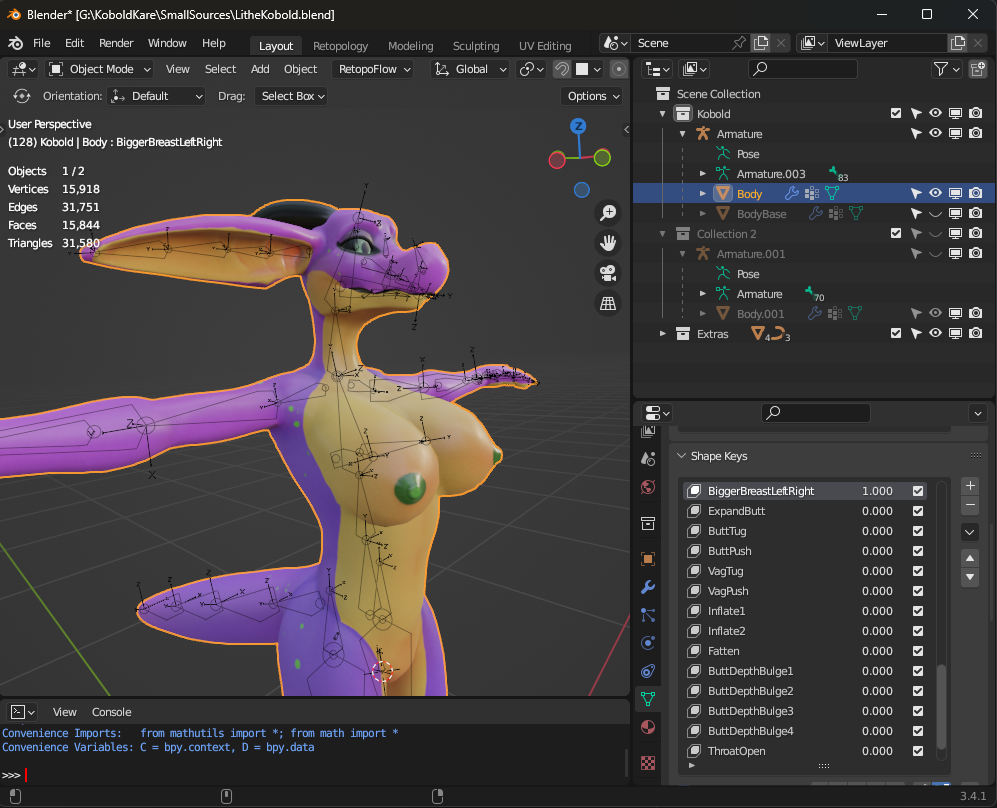 
   Lilith_BiggerBreastLeftRight.png

### Configuring the InflatableBreast

On the Kobold component of your prefab, add a InflatableBreast listener to the `Boobs Inflator` listener list.

Base Breast transform is the bone that is scaled.

Jiggle Bone Breast Transform is actually used to look up the JiggleRig AND JiggleSkin to change it's blend settings. It's set to Nipples in this configuration since that's a JiggleSkin, and a child of the JiggleRig.

The Animator receives a float called "BreastSize" that you can use to animate the breasts spreading apart.

You don't need a jiggle skin if you don't have one, feel free to leave it blank.

   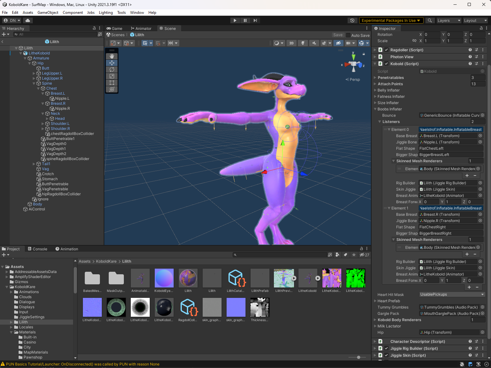 
   Lilith_breast_inflator_settings.png

## Fatness Inflater

This inflater is to add a chubbiness to the character, as if they ate too much food.

   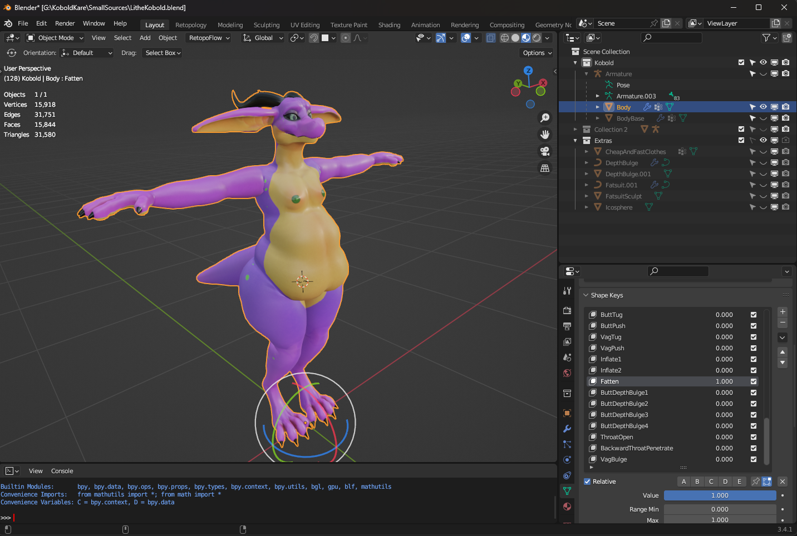 
   Lilith_fatsuit_shape.png

I used the blockout technique described above to do it.

   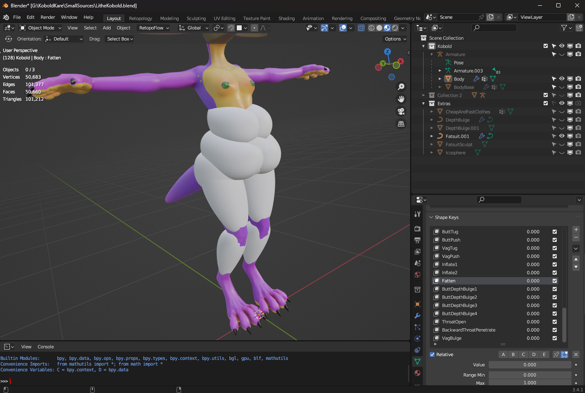 
   Lilith_fatsuit_blockout.png

### Configuring the Fatness InflatableBlendshape

Since the fatten effect is so simple, it only uses a InflatableBlendshape listener targeting the fatten blendshape.

   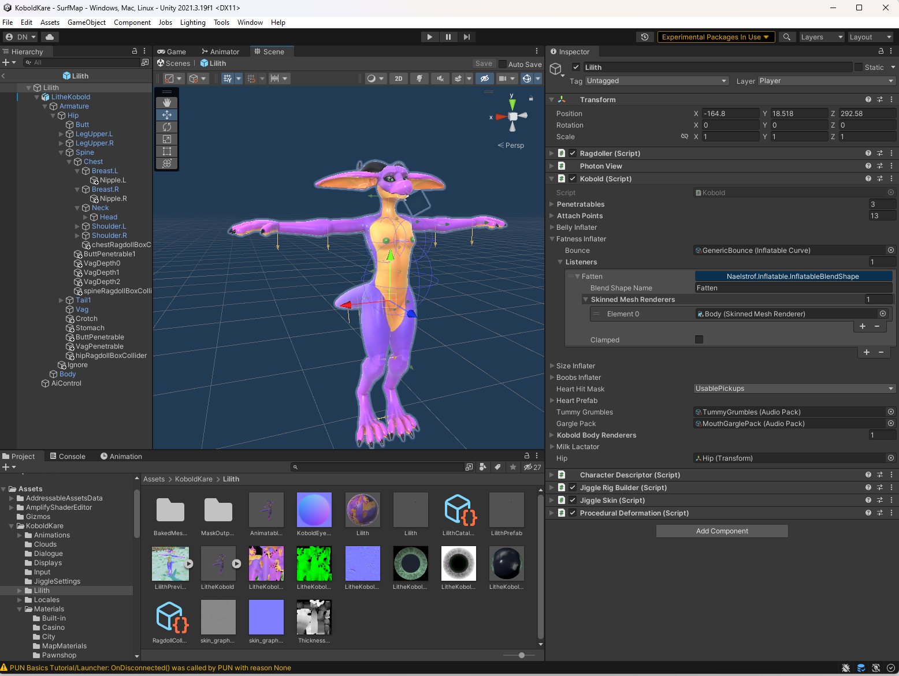 
   Lilith_fatness_inflater_setup.png

I purposefully unchecked "Clamped", which allows the blendshape to be overdriven for extremely fat looking shapes. This tends to break the intended shape so it's up to you if you want the blendshape clamped or not.

## Belly Inflater

This inflater is used for when the character is being filled (and overfilled) with fluids. It's somewhat complicated because it's done in two-stages.

In order to avoid adding more bones and bone weights, its done entirely through blendshapes.

### Inflate1 shape

The first shape is to attempt to make the belly as spherical as possible. This is so that the next shape can expand it spherically with no artifacting.

   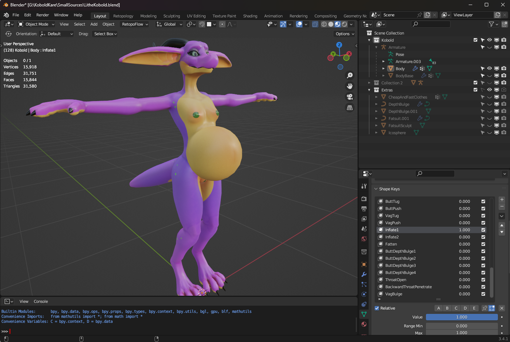 
   Lilith_inflate1_shape.png

I again used the blockout technique, except I used a sphere as the underlying shape.

   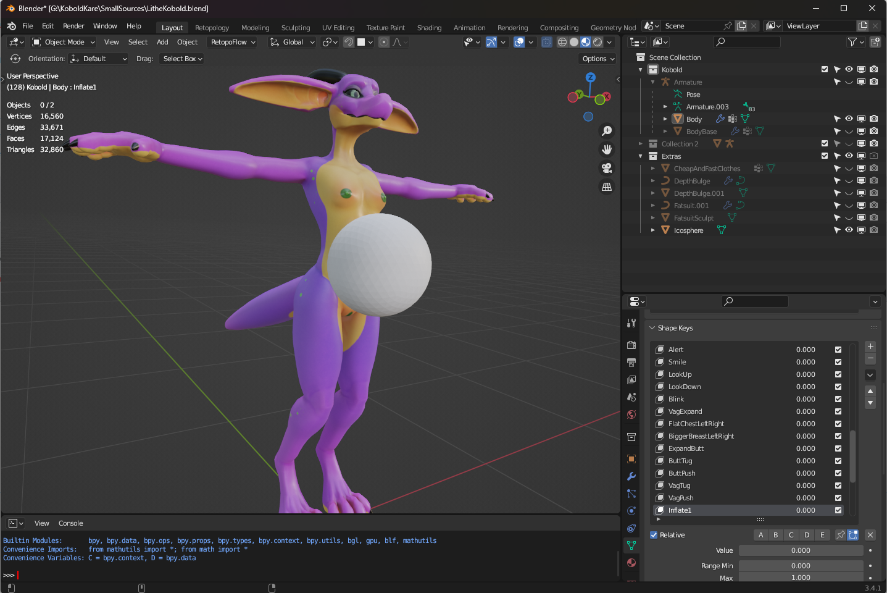 
   Lilith_inflate1_blockout.png

### Inflate2 shape

The second shape is only triggered while the first shape is already in full-effect. This means that the Inflate2 blendshape needs to be an additive shape, taking the sphere that was made from Inflate1 and making it expand. It will never be triggered by itself (and it's only shown in the video below to help display that it's not intended to be triggered by itself.)

   <a href="../images/setting-up-inflation-features/Blender_s4oNEFiZNi.mp4">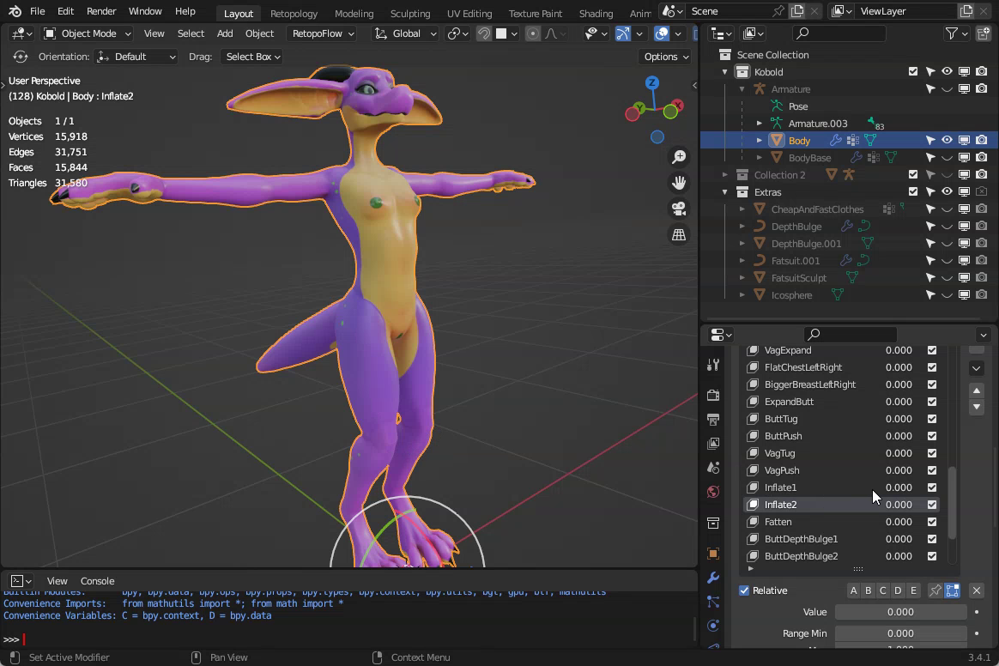 
   Click to watch the video</a>

How I created the additive shape, is by taking the original blockout shape for Inflate1 and making it larger. Then creating a completely regular shape key with it.

   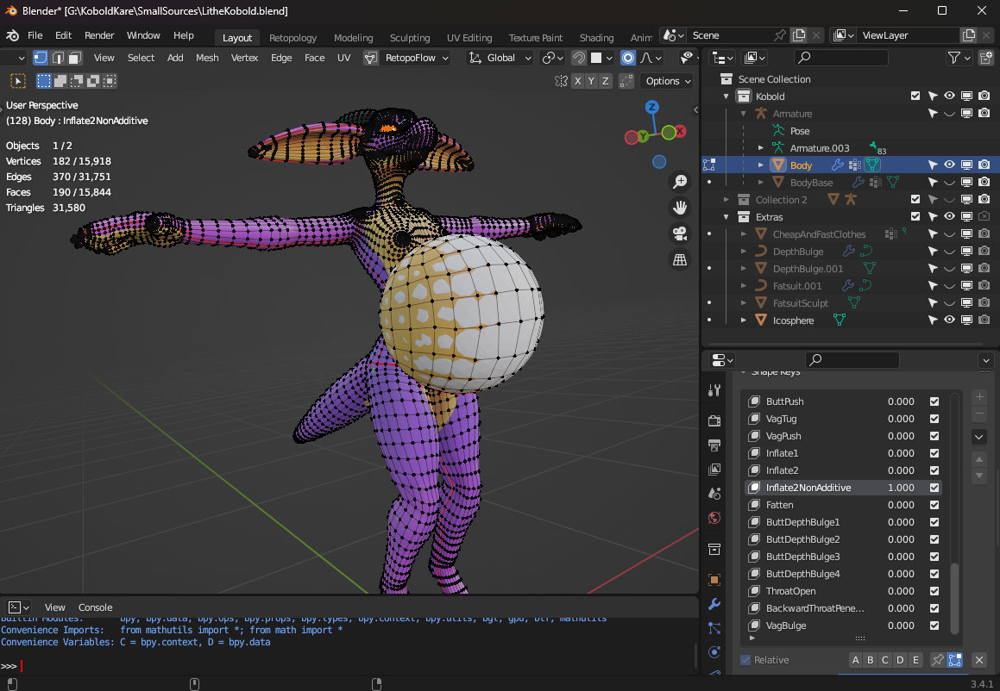 
   Lilith_inflate2_non_additive.png

Lets call it Inflate2 Non-Additive for now.

Then to make it into an additive shape, all we need to do is select every vertex in edit mode with Inflate2 Non-Additive selected in the Shape Keys tab, then do a Blend From Shape command. Select Inflate1 as the target shape, makes sure "Add" is checked, and set the blend amount to -1.

   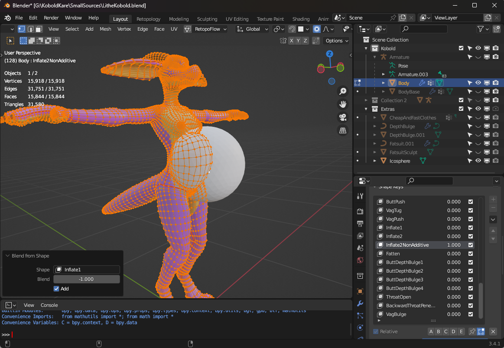 
   Lilith_inflate2_additive.png

Now we have it so that Inflate1 can be fully triggered, then Inflate2 can be triggered from any value from 0 to 10ish to get ridiculous sized inflations without messing up the round shape!

### Configuring the InflatableBelly

It uses the two shapes we set up earlier, plus an optional JiggleSkin to blend. The transform is used to look up which JiggleSkinZone to adjust.

   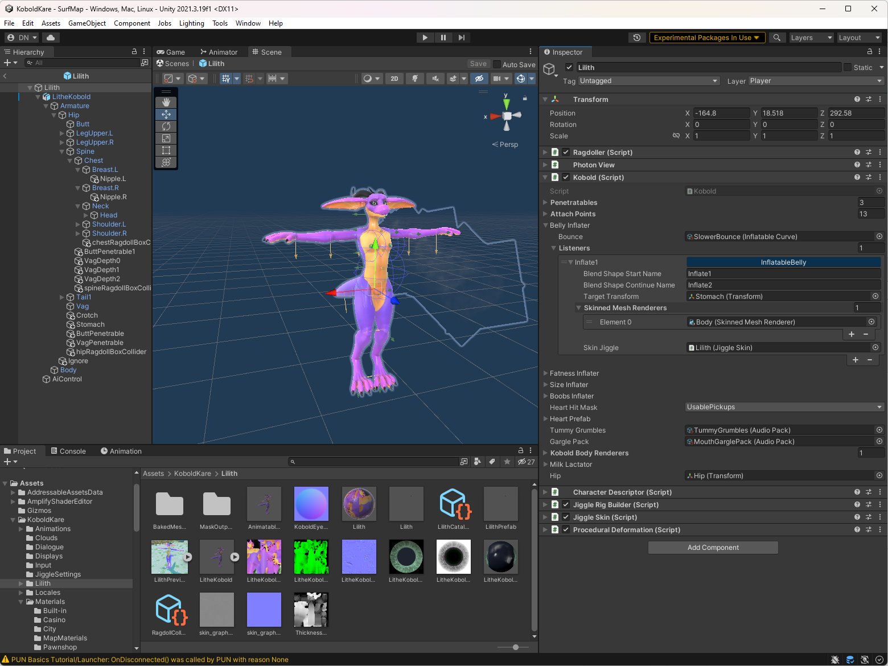 
   Lilith_inflate_config.png

## Size Inflater

This one is super simple! You could make it more complex and drive some monstrous or spikey shapes in combination-- though right now all I do is set up a InflatableTransform listener targeting the root of the prefab so it gets bigger.

   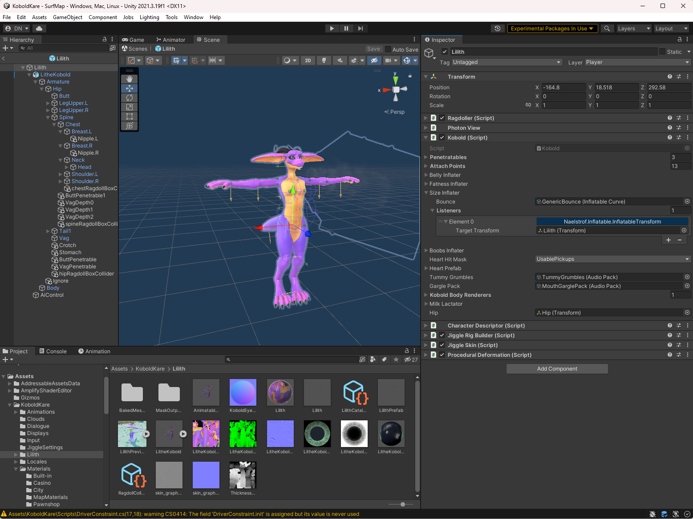 
   Lilith_size_inflater.png

## Custom inflaters

Right now in KoboldKare, inflaters are hard-coded, but since they are also totally optional, it's not unreasonable to add some various extra inflaters in the base-game. Make a github issue and we'll see what we can do!
