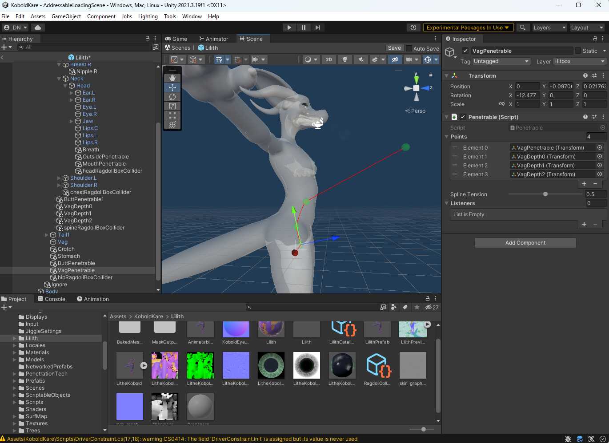

The penetrative VFX in KoboldKare is driven through arbitrary penetration listeners, which makes it extremely customizable.

You can drive any manner of effect, and it's meant to be a decent mix of dynamic and authored effects. The tools are clunky and hard to use, but hopefully shouldn't be too terribly hard to set up.

## Prerequisites

For this article I'm going to simply show the steps I took to set up the penetrative effects that exist in the game. The game assumes you have at least one egg-laying penetrator, anything else is optional.

### Penetrative offset bone

Each soft-bodied penetration should have a bone that it can move to offset the hole. This is for uneven penetrators. This isn't actually required, but greatly increases the accuracy of the penetration effects.

   <a href="../images/setting-up-penetrative-vfx/Blender_txlTi9cRWH.mp4"> 
   Click to watch the video</a>

For the butt, vagina, or nipples I use a bone since they softly deform. For mouths, ears, or other boney penetrables I would not bother, since having them slide around to fit penetrators would look strange.

## Getting started

We need to specify the path from which penetrators will take when they start to penetrate. Penetrables dictate the path that they will take, and we're capable of authoring them.

Duplicate the offset bone (ctrl+d) and add a Penetrable as a component, then specify the path that a penetrator would take if it were to penetrate it.

    
   Lilith_butt_path.png

You can use other empties to help author the path the penetrator will take, making sure the empties are parented to bones that make sense.

    
   Lilith_vag_path.png

For the vagina path, I expect large penetrators to push the belly out.

Penetrables are one-way only, so if you want penetrators to go both-ways, you'll need to specify the same path but in reverse.

    
   Lilith_mouth_path.png

## Penetrative Listeners

Now that we have a path set up, we want to set up listeners that can respond to the penetrator's girth and shapes. I'm going to list a few that I use, however you can mix and match as many as you think is necessary. VFX is largely an art after all!

### PushPullExpand Blendshape Listener

If you have pushing, pulling, and expanding blendshapes, you can use this listener to trigger the blendshapes appropriately.

Simply trigger the expand blendshape on your model manually, then add the PenetrationTech.PushPullExpandBlendshape listener.

    
   Lilith_push_pull_blendshape_configuration.png

Offset Correction Bone is required, however if this hole doesn't have one, you can just give it a blank empty to make it happy. It'll happily move the empty without hurting the rest of the effect.

Base girth radius is how "wide" the hole is in its neutral shape. It's okay to leave this at zero if it's mostly closed by default.

Blend Shape girth radius is the radius in meters of the hole when it's triggered. Try to get the circle to match up the best you can. You may need to adjust the path so that the circle is more aligned.

Pull T and push T are how far the hole moves when the pull/push blendshapes are triggered. This adjusts where the girth is sampled so that the hole properly samples the girth of the penetrator properly while sliding around.

### Simple Blendshape Listener

Similar to the PushPullBlendshape listener, but this one only handles the expansion.

Make sure to set the T value to match where it should sample girth to trigger the effect.

I use it for all of the depth bulges within a character. Below is a screenshot of one in isolation.

    
   Lilith_simple_blendshape_listener_configuration.png

If you do several in a row, you can have them add up to an authored bulge shape like so:

   <a href="../images/setting-up-penetrative-vfx/Blender_SsCPouTiwj.mp4"> 
   Click to watch the video</a>

### Clip Listener

This listener actually triggers callbacks to the penetrator to inform it how to perform visual clipping. You should add this listener on any opaque character, as it otherwise will show any imperfections in the penetration VFX.

This is also how you allow for all-the-way-through to work or not, to specify the range at which the penetrator should be clipped to be invisible.

### KoboldJawOpenListener

This listener is designed to assist in making oral animations. It mainly disables the kobold's look-at routines and makes them look up so that the penetrator doesn't need to bend so much.

    
   Lilith_jaw_open_listener.png

Yes you do need to put this on the end of the butt penetrable, and at the start of the mouth penetrable. I usually have them trigger a unique facial expression if the mouth somehow opens from the butt penetrable.

### Kobold Penetrable Listener

This listener simply reports movement to the Kobold for stimulation purposes. If you think the hole being penetrated should be pleasurable, make sure to add this listener!

### Lengthwise blendshape listener

This listener, instead of listening to girth changes, it listens to depth changes. This allows you to have a bulge that sticks out infinitely from the belly based on the depth of a penetrator.

    
   Lilith_lengthwise_blendshape_listener.png

You want the yellow range to show when the blendshape should start moving, and when it's maxed out. If penetrators go beyond this range it will attempt to overdrive the shape, but only if you have overdrive enabled.

## Procedural Deformation

This is a complicated feature that allows you to enable per-vertex offsets for characters. There's two modes: Detail, and non-detail.

### Detail Procedural Deformation

What my penetration tech does is approximate the size of the dick via offset and girth curves-- but there's certain shapes that cannot be represented that way, for example a knot that is wider than it is tall:

    
   Wide_knot.png

So what I do is I take the girthmap, and generate these approximations-- then from that I can calculate a new map that represents the differences between the real model, and the approximation. This is the "detail map".

    
   Dragon_dick_approximations.png

Armed with a detail map, we can manually author every shape as a circular blendshape like so:

   <a href="../images/setting-up-penetrative-vfx/Blender_A6dMLvw93q.mp4"> 
   Click to watch the video</a>

Then allow the Procedural Deformation monobehavior in "Detail" mode help adjust our circular blendshapes to fit better.

   <a href="../images/setting-up-penetrative-vfx/Unity_wzPCmH1xOa.mp4"> 
   Click to watch the video</a>

   <a href="../images/setting-up-penetrative-vfx/Unity_DiEsZfVzZA.mp4"> 
   Click to watch the video</a>

It's simple to set up. After we've already set up our penetrables, we just need to do the following:

1.  Add a Procedural Deformation monobehavior on the root of the prefab.
2.  Add each penetrable to it (maximum of 4)
3.  Specify which meshes get deformed.
4.  Make sure that the meshes is the original (You cannot bake twice unless you revert back to the original mesh).
5.  Hit bake to generate a new mesh.

    
   ProceduralDeformation_bake.png

As long as the body has a compatible Skin shader, it should automatically start working. See Testing below to double check.

## Testing

At anytime during your configuration, provided there is no errors listed at the top of the penetrable, you can actually test your configuration by dragging a working penetrator into the prefab to quickly test things out in the editor.

1.  Drag the EquineDick prefab into the scene.
2.  Set the Penetrator Deform Basic's Penetrated Hole to one of your penetrables.
3.  Do your best to insert it.
4.  When you're done testing, make sure to delete the EquineDick!

   <a href="../images/setting-up-penetrative-vfx/Unity_PLSgWysTq7.mp4"> 
   Click to watch the video</a>

## Final configuration

When you've got your working penetrables, you need to let the Kobold know which hole is for what.

    
   Lilith_penetrable_configuration.png

Female exclusive penetrables get disabled when the character has a dick attached. For hermaphrodite characters, it's okay to simply have no female exclusive penetrables.

Can lay egg should be enabled for penetrables that should lay an egg if the kobold is pregnant. There needs to be at least one of these!
