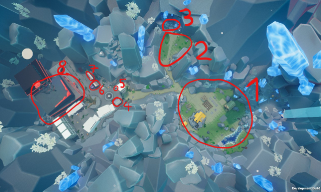

   

   Map1.0.PNG

This page will list all the **Locations** you can visit in KoboldKare.

# Getting Around

See [Movement](Movement "wikilink") for details on Surfing and

Bunny-Hopping, which can help speed your transition from location to

location.

To assist with travel, there are Jump pads placed in strategic locations

around the map. These propel the player and/or items towards a set

destination. the jump pad can be bought for 80 dollars at the builder's

shop, they are located at your farm and in town.

<figure>

<figcaption>Jump_pad.PNG</figcaption>

</figure>

## House

The **House** is where you'll start the game.

**Inside you'll find:**

  

*The Bed:* Pressing "E" on the bed will allow you to gain energy. also

works as a sex location.

<figure>

<figcaption>Bed.PNG</figcaption>

</figure>

  

*The Shower:* Press "E" on the shower to turn on. Allows water refill as

well as cleaning kobold.

<figure>

<figcaption>Shower.PNG</figcaption>

</figure>

  

*The Toilet:* Press "E" starts an animation and gets rid of your stomach

contents.

<figure>

<figcaption>Toilet.PNG</figcaption>

</figure>

And you can buy:

  

*The Bathtub:* similar to the shower but easier to use, works as a

container can store 100 unit, buying gives you an additional sex

location.

<figure>

<figcaption>Bath.PNG</figcaption>

</figure>

  

*A Blender:* works like a grinder but faster, Sucks items nearby if they

get too close.

<figure>

<figcaption>Blender2.PNG</figcaption>

</figure>

- *Sex Animations*: There are certain locations in the house with

  specific animations. See ***[Sex

  Animations](Sex_Animations "wikilink")*** for more information

## The Farm

This is where you will spend most of your time, the farm has:

  

*The Mailbox*: this is where you will receive quests press E to collect

them

<figure>

<figcaption>Mailbox.PNG</figcaption>

</figure>

  

*Farm Plots*: This is where you can plant kobolds and plants, things

planted here need to be watered twice by a bucket, once upon planting

and a second time halfway through grow time.

<figure>

<figcaption>Farm2.PNG</figcaption>

</figure>

  

*Sqisher*: This extracts the stomach meter without wasting all the

liquid inside like the toilet

<figure>

<figcaption>Press.PNG</figcaption>

</figure>

There are additional [sex locations](Sex "wikilink") in the yard

## The River

The lake is in the middle of the map. While Kobolds can neither swim nor

drown, there is also fish that give meat when interacted with.

  

*Inflator*: There are 3 sections to the machine. When facing head on,

the left is where you put a kobold you want to inflate. The button is

for injecting stored liquid from the tank on the right. The tank can

store 120 unit. On the right should be breeding mount (not included with

the machine but included as breed mount upgrade from kitchen).

- You can put any liquid in the tank by "throwing" liquid at it (and the

  breeding mount by extension).

- The bellows can be held to increase the amount of liquid pumped when

  released, but it can't be specified; fully charge takes about 5

  seconds.

<figure>

<figcaption>Inflator.PNG</figcaption>

</figure>

## Huts 1&2

<figure>

<figcaption>Hutts.PNG</figcaption>

</figure>

Hut 1 is for egg laying Hut 2 is a kitchen.

  

*Hut 1 contains:*

*Egg Laying Station:* drop a pregnant kobold next to it to begin laying

an egg

<figure>

<figcaption>Egg_layer.PNG</figcaption>

</figure>

and one [sex location](Sex "wikilink")

  

*Hut 2 contains:*

*A Blender*: exactly like a grinder but faster

<figure>

<figcaption>Blender1.PNG</figcaption>

</figure>

*A Breast Milking Machine*: A kobold with breasts lays down on the

machine, and a second kobold must use the station to help milk them.

\*Milk output is based on breast size. See

[Alchemy](Items#Liquids "wikilink") for more information on how to

effect breast size.

*A Cum Milking Machine*: Used to assist with cum extraction from a

kobold with a dick. \*Cum output is based on ball size, with a slight

increase from dick size. See [Alchemy](Items#Liquids "wikilink") for

more information on how to effect ball and dick size.

<figure>

<figcaption>Milkcum.PNG</figcaption>

</figure>

## Town

Walk the path down the valley toward the giant buildings you'll arrive

in the **Town**.

**Here, among other cosmetic buildings, you'll find:**

  

*The Shop:* (*aka "Macromart", previously "Thicc N' Kwicc:"*) Located on

the farther left side of town, the Shop is where you can buy buckets,

seeds, and kobold eggs

<figure>

<figcaption>Store.PNG</figcaption>

</figure>

  

*The Tool Store*: they sell cosmetic items and useful things like regent

scanners, watering cans, troughs, and ice.

<figure>

<figcaption>Store3.PNG</figcaption>

</figure>

  

*The Builder's Hut:* the builders hut is where you buy machines for your

farm

<figure>

<figcaption>Build.PNG</figcaption>

</figure>

<figure>

<figcaption>Shop1.PNG</figcaption>

</figure>

<figure>

<figcaption>Shop2.PNG</figcaption>

</figure>

  

*The Goblin's Crown:* there is a plinko machine inside, where you can

spend 25 dollars to get rewards.

<figure>

<figcaption>Goblin's_crown.PNG</figcaption>

</figure>

<figure>

<figcaption>Plinko_macine.PNG</figcaption>

</figure>

  

*The Pawnshop:* Previously a foreboding hole in the world, the pawnshop

*Zany Ztuff* has bombs, a dildo (not pictured below), and a scanner. You

can find it between the two buildings as you hang a Left when first

entering town. Items from the pawnshop cannot be refunded.

<figure>

<figcaption>Store_2.PNG</figcaption>

</figure>

## Forests

To the right of the town is the forest, witch leads directly into the

cave.

Here you will find:

  

*Eggplants, Pineapples, Melons, and Bananas*: These fruits grow high

among the trees and can be collected.

*one mushroom*: the mushroom is in the corner but more can be found in

the cave

See [Items](Items "wikilink") for more information on these fruits.

<figure>

<figcaption>Fruit.PNG</figcaption>

</figure>

## Cave

With a little bit of exploring, you may find the cave at the back of the

forest. in the cave you can easily find mushrooms.

Also in the cave you can find the tent with has a second shop that sells

buildings

  

**The shop sells**

<!-- -->

  

*Mind swap*: this is at the farm in the back and it can swap your kobold

with another one

<figure>

<figcaption>Mind_swap.PNG</figcaption>

</figure>

  

*Pipe*: this machine can be toggled to spawn differing size kobolds and

is placed directly outside the tent.

<figure>

<figcaption>Kobold_printer.PNG</figcaption>

</figure>

